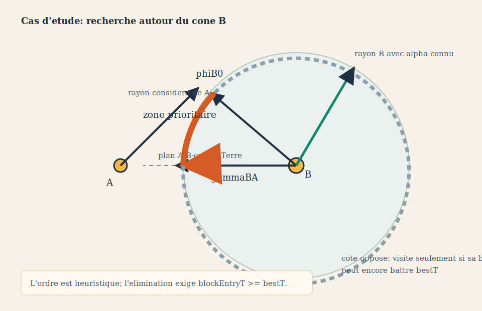
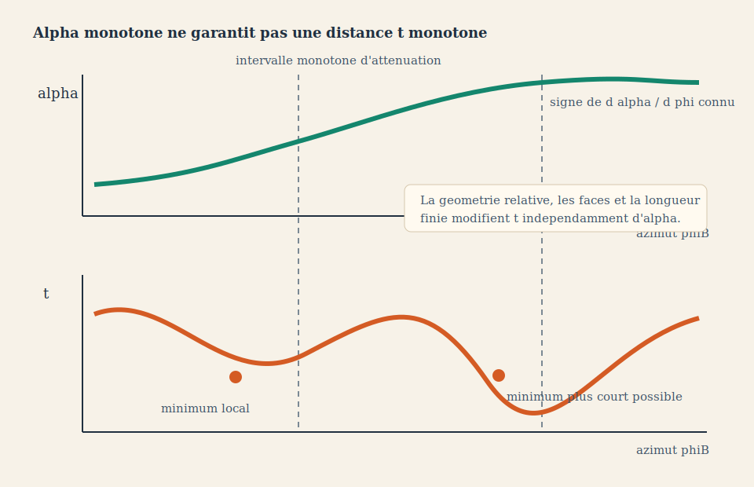
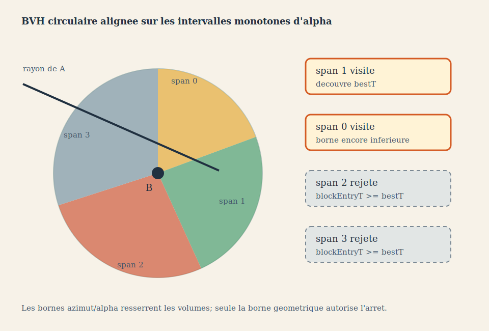
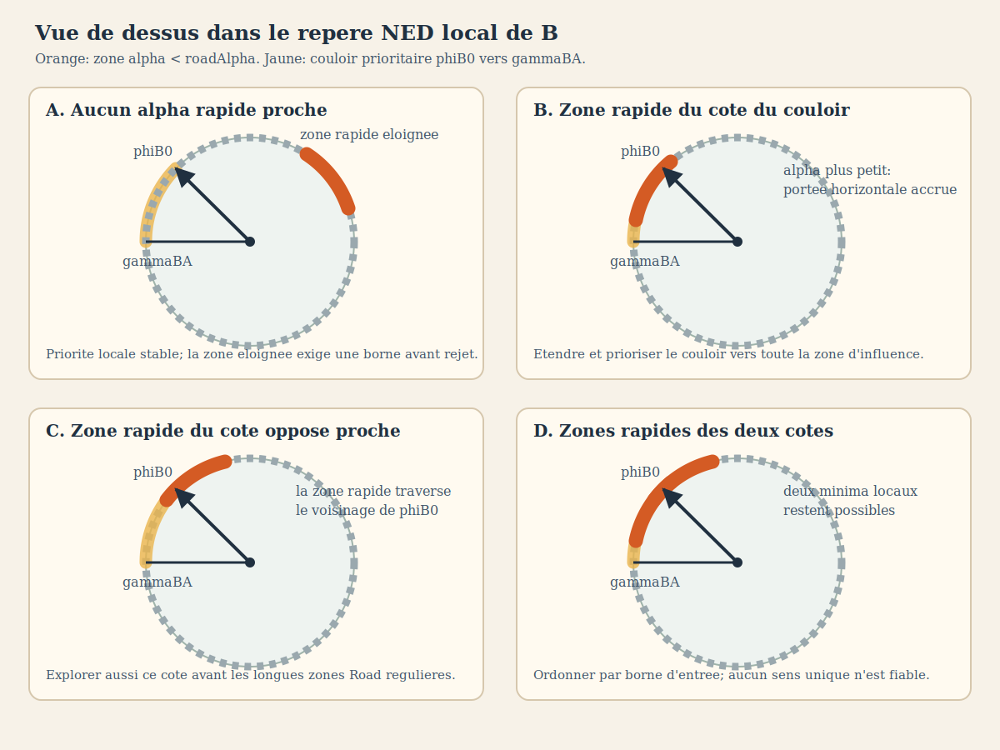
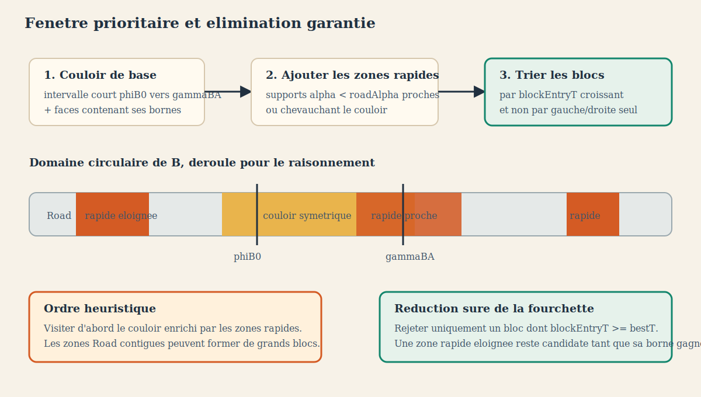

# Cas D'Etude Des Intersections Conscientes D'Alpha

## Objectif

Ce document illustre les hypotheses a mesurer avant d'optimiser la recherche
des intersections entre un rayon du cone A et les faces du cone B.

Les dessins sont des schemas explicatifs. Ils ne constituent pas des preuves
geometriques et ne sont pas a l'echelle.

## Capacites De Representation Retenues

La documentation emploie plusieurs formats selon le besoin:

- PlantUML pour les sequences, responsabilites et enchainements de fonctions;
- SVG pour les constructions geometriques, graphes et cas d'etude;
- Mermaid ou Graphviz restent possibles pour des graphes de dependances;
- des rendus Babylon.js instrumentes pourront plus tard produire des captures
  de cas reels et superposer les faces visitees.

Le SVG est retenu ici parce qu'il est versionnable, editable, net a toute
echelle et affichable directement dans la documentation.

## Cas 1: Rayon Symetrique Et Zone Prioritaire



Pour un rayon de A, `phiB0` est son symetrique rapporte au repere de B. Le
parcours commence pres de `phiB0` et progresse en priorite vers `gammaBA`, qui
represente la direction de A depuis B et appartient au plan
`A-B-centre Terre`.

L'alpha de chaque rayon B est deja connu. Sur la zone prioritaire, sa variation
peut donc indiquer quelles faces visiter en premier. Cette information
ameliore la probabilite de trouver rapidement un petit `bestT`.

Elle ne permet pas d'ignorer sans preuve le cote oppose. Une deformation plus
eloignee peut encore produire une intersection plus courte.

## Cas 2: Alpha Monotone Mais Distance T Non Monotone



Sur un intervalle d'attenuation, `alpha(phiB)` peut etre strictement monotone.
La distance d'intersection `t(phiB)` peut toutefois presenter un minimum local
supplementaire, car elle depend aussi de la geometrie relative entre A et B.

Consequence:

```text
alpha monotone => ordre heuristique utile
alpha monotone != preuve que t est monotone
```

Le benchmark doit enregistrer les violations de monotonie de `t` pour
quantifier le risque de toute regle d'arret empirique.

## Cas 3: BVH Circulaire Alignee Sur Les Attenuations



Le contour de B est decoupe aux changements d'influence et limites
d'attenuation. Les blocs obtenus ont des bornes connues d'azimut et d'alpha.

Pour chaque bloc, une enveloppe conservatrice fournit une borne inferieure
`blockEntryT`. Le bloc peut etre ignore sans perdre d'intersection lorsque:

```text
blockEntryT >= bestT
```

Le parcours peut etre ordonne par probabilite, mais l'elimination repose
uniquement sur cette borne geometrique.

## Cas Limites Dans Le Repere Local De B



Le contrat scientifique impose:

```text
alphaB(phi) <= roadAlpha
```

Une liaison terrestre plus rapide que Road produit strictement
`alphaB(phi) < roadAlpha` dans sa zone d'influence. Pour une longueur de rayon
fixe, sa projection horizontale vaut:

```text
horizontalLength = coneLengthMeters * cos(alphaB(phi))
```

Elle augmente donc quand alpha diminue. En vue de dessus, une zone rapide
avance localement le bord de B et peut creer une intersection plus proche.

Quatre cas doivent etre caracterises:

1. aucune zone rapide proche de `phiB0` ou du couloir vers `gammaBA`;
2. une zone rapide chevauche le couloir prioritaire;
3. une zone rapide est proche de `phiB0` du cote oppose au couloir;
4. des zones rapides existent des deux cotes.

Dans le premier cas, l'ordre symetrique Road reste la meilleure priorite
locale. Dans les deux cas unilateraux, le support complet de l'influence doit
etre ajoute au debut de l'ordre de parcours. Dans le cas bilateral, aucun sens
gauche/droite unique n'est fiable: les blocs doivent etre tries selon leur
borne geometrique.

## Fourchette De Recherche Candidate



La fourchette prioritaire candidate est l'union de:

- l'intervalle court `phiB0 -> gammaBA`;
- les faces contenant ses deux bornes;
- toutes les zones `alpha < roadAlpha` qui chevauchent cet intervalle;
- les zones rapides voisines de `phiB0`, des deux cotes.

Cette union definit un ordre de recherche, pas une elimination garantie. Les
zones rapides eloignees et les longues portions Road peuvent etre regroupees
en blocs. Elles ne sont ignorees que lorsque leur borne conservatrice respecte:

```text
blockEntryT >= bestT
```

Le parametre definissant le « voisinage » de `phiB0` ne doit pas etre choisi
arbitrairement. Les benchmarks doivent mesurer plusieurs largeurs exprimees
en nombre de faces et en radians, puis comparer le rang de decouverte du
minimum avec l'oracle exhaustif.

## Cas A Generer Pour Le Benchmark CPU

### A. Cone Routier Regulier

- alpha constant sur tout B;
- valide la geometrie de base et le rayon symetrique;
- compare parcours exhaustif et BVH sans effet d'attenuation.

### B. Influence Unique Entre PhiB0 Et GammaBA

- une liaison rapide deforme B dans la zone prioritaire;
- verifie si la variation d'alpha ameliore l'ordre de visite;
- mesure le nombre de faces avant decouverte du minimum.

### C. Influence Unique Du Cote Oppose

- une liaison rapide est placee hors de la zone prioritaire;
- verifie que le critere d'arret ne supprime pas un minimum plus proche;
- constitue un cas de securite obligatoire.

### D. Deux Influences Et Plusieurs Minima Locaux

- deux liaisons de vitesses differentes;
- leurs zones d'attenuation se chevauchent ou se succedent;
- mesure les violations de monotonie de `t`;
- compare les trois lois d'interpolation candidates.

### E. Passage Circulaire

- une influence proche de `-PI/PI`;
- valide les intervalles circulaires et la fermeture de la derniere face;
- refuse toute discontinuite artificielle.

### F. Longueur Locale De Cone

- B utilise une longueur locale differente de la longueur globale;
- verifie les enveloppes et les bornes d'intersection;
- mesure l'efficacite du filtrage selon la longueur.

## Oracle Et Strategies Comparees

L'oracle teste toutes les faces de tous les voisins statiques retenus. Les
strategies candidates doivent produire exactement le meme minimum:

| Strategie | Utilisation |
| --- | --- |
| exhaustive | oracle de conformite |
| ordre symetrique seul | mesure du gain d'ordre sans elimination |
| droite/gauche empirique | mesure du risque, jamais oracle |
| BVH circulaire fixe | reference d'acceleration generique |
| BVH circulaire consciente d'alpha | candidat specifique au projet |
| intervalle d'azimuts possible | filtre candidat complementaire |

## Mesures Specifiques

En plus des durees, le rapport doit fournir:

- nombre de faces et de blocs visites;
- position de la face gagnante dans l'ordre de parcours;
- proportion des minima situes entre `phiB0` et `gammaBA`;
- nombre de changements de signe observes dans la suite des `t`;
- correlation entre le sens predit par alpha et la variation reelle de `t`;
- intersections manquees et ecart par rapport a l'oracle;
- cout de construction des intervalles et de la BVH;
- resultats separes pour les interpolations `alpha`, `cos(alpha)` et
  `tan(alpha)`.

Une strategie de production doit manquer exactement zero intersection sur les
jeux de conformite.

## Etat Actuel De La Decision

Les elements suivants sont retenus:

- l'ordre symetrique et les supports rapides definissent une priorite;
- la priorite seule n'est jamais un filtre de production;
- les plages Road majoritaires doivent etre regroupees en blocs;
- les supports rapides proches ou chevauchants enrichissent la fourchette
  prioritaire;
- les supports rapides eloignes restent candidats jusqu'au rejet par borne;
- la filtration CPU doit etre implementee et benchmarkee avant son portage
  WebGL2 ou WebGPU;
- les benchmarks algorithmiques contournent le cache annuel;
- le cache annuel stocke seulement les distances cone/cone et reste limite a
  l'instance applicative.
