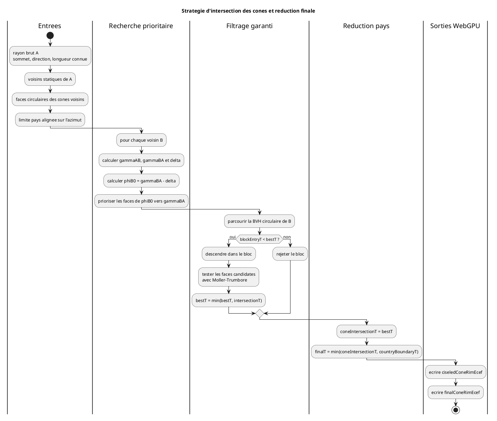

# Architecture Des Intersections Entre Cones

## Statut

Ce document formalise les decisions retenues avant l'implementation de la
reference CPU puis du kernel WebGPU d'intersection entre cones.

Sources confrontees:

- `toBabylon/src/application/cone/shaders/ciseledCones.frag`;
- `toBabylon/src/application/common/shaders/rayIntersectTriangle.glsl`;
- `toBabylon/src/application/cone/shaders/finalCones.frag`;
- `bibliographie/intersection.odt`;
- `bibliographie/RayTriangleIntersection/Fast MinimumStorage RayTriangle Intersection.pdf`;
- documents locaux sur les intersections de quadriques et les constructions
  Voronoi GPU.

Schéma:



Cas d'etude geometriques:

- [heuristique droite/gauche consciente d'alpha](cone-intersection-alpha-aware-case-studies.md);
- [rayon symetrique et zone prioritaire](diagrams/intersections/alpha-aware-symmetric-search.svg);
- [alpha monotone et distance d'intersection](diagrams/intersections/alpha-versus-intersection-distance.svg);
- [BVH circulaire alignee sur les attenuations](diagrams/intersections/alpha-aware-circular-bvh.svg).
- [cas limites dans le repere local de B](diagrams/intersections/local-b-alpha-neighborhood-cases.svg);
- [construction de la fourchette prioritaire](diagrams/intersections/alpha-aware-search-window.svg).

## Objectif

Pour chaque couple `(cityAIndex, azimuthSampleIndex)`, le pipeline cherche la
premiere distance positive le long du rayon brut du cone A:

```text
rayA(t) = summitA + t * directionA
0 < t <= coneLengthA
```

La sortie finale est une reduction de distances:

```text
coneIntersectionT = min(rawT, intersections avec les cones voisins)
finalT = min(coneIntersectionT, countryBoundaryT)
```

Le pipeline ne cherche pas a parametrer la courbe complete d'intersection de
deux surfaces. Il cherche uniquement le premier `t` pertinent pour chaque
rayon echantillonne.

## Decisions Metier

- la recherche est limitee aux villes presentes dans `overlapCandidates`;
- ce voisinage statique constitue le perimetre metier retenu;
- aucune classification `cone regulier` / `cone complexe` n'est necessaire;
- chaque cone est traite uniformement comme un eventail circulaire de faces;
- la longueur maximale des rayons est connue avant l'intersection;
- les limites pays sont appliquees en dernier dans la reduction;
- le profil CPU conserve des etapes separees pour les tests;
- le profil WebGPU peut fusionner les reductions cone/cone et pays dans une
  meme invocation et produire les deux sorties.

## Longueur Des Cones

Dans `toBabylon`, la longueur maximale globale est:

```text
extrudedHeight = earthRadiusMeters * intrudedHeightRatio
```

Elle est injectee dans les shaders sous le nom `longueurMaxi`.

La colonne caracteristique `cities.radius` existe egalement pour definir une
longueur locale, notamment pour les iles proches d'un continent, mais le
pipeline historique ne l'applique pas effectivement aux intersections.

La migration doit distinguer:

```ts
interface ConeLengthBuffers {
  defaultConeLengthMeters: number;
  cityConeLengthMeters: Float32Array;
}
```

`cityConeLengthMeters[cityIndex]` utilise la longueur locale lorsqu'elle est
definie, sinon la longueur globale. Cette information est critique pour les
volumes englobants, les bornes de rayon et les benchmarks.

## Representation Uniforme Des Faces

Pour un cone B:

```text
faceB[j] = triangle(
  summitB,
  rawConeRimEcef[B, j],
  rawConeRimEcef[B, (j + 1) modulo azimuthSampleCount]
)
```

Le sommet est lu depuis `cityNed2EcefMatrices`. Il n'est pas duplique dans les
buffers de bord.

## Rayon Symetrique Initial

Pour le rayon d'azimut `phiA` porte par A:

```text
gammaAB = azimut de B depuis A
gammaBA = azimut de A depuis B
delta = wrapSigned(phiA - gammaAB)
phiB0 = wrapPositive(gammaBA - delta)
```

`phiB0` est le rayon de B symetrique du rayon A par rapport au plan median des
villes A et B. Il remplace l'hypothese incorrecte selon laquelle le rayon A
serait necessairement dans le plan `A-B-centre Terre`.

La zone ayant la probabilite la plus forte de contenir la premiere
intersection est l'intervalle angulaire court entre `phiB0` et `gammaBA`.
L'ordre de recherche privilegie est donc:

1. face contenant `phiB0`;
2. progression de `phiB0` vers `gammaBA`;
3. continuation au-dela de `gammaBA`;
4. parcours du cote oppose a `phiB0`.

Cet ordre accelere la decouverte d'un petit `bestT`, mais ne constitue pas a
lui seul un critere d'arret.

## Risque De L'Heuristique Droite/Gauche

Une augmentation locale des distances ne garantit pas que les faces suivantes
ne produiront pas une intersection plus courte:

```text
80, 85, 90, 60
```

Un cone deforme peut presenter plusieurs minima locaux. Une variante empirique
peut mesurer plusieurs augmentations consecutives et une marge de distance,
mais elle ne peut etre retenue en production sans comparaison avec l'oracle.

## Intervalles Monotones D'Alpha

Le cone B n'est pas une surface inconnue au moment de rechercher
l'intersection. Pour chaque rayon echantillonne, son azimut, son alpha et sa
longueur sont deja disponibles dans les buffers du cone brut.

La loi actuelle interpole alpha avec `smoothstep` entre deux influences. Elle
est monotone sur chaque intervalle dont les deux influences restent
inchangees. Le domaine circulaire de B peut donc etre decoupe aux points
suivants:

- azimuts des liaisons actives;
- limites des zones d'attenuation;
- changements de liaisons inferieure ou superieure selectionnee;
- rayon symetrique `phiB0`;
- direction `gammaBA` du plan `A-B-centre Terre`;
- passage circulaire `0/2 PI`.

Chaque intervalle porte au minimum:

```ts
interface AlphaMonotonicSpan {
  azimuthMinRadians: number;
  azimuthMaxRadians: number;
  alphaMinRadians: number;
  alphaMaxRadians: number;
  alphaVariationSign: -1 | 0 | 1;
  firstFaceIndex: number;
  faceCount: number;
}
```

La connaissance du signe de `d alpha / d phiB` permet de mieux ordonner les
faces susceptibles de rapprocher la surface de B du rayon A. Elle ne permet
pas, seule, de deduire le signe de `d t / d phiB`: la distance `t` depend
aussi de l'ecart au rayon symetrique, des reperes NED relatifs, de la courbure
terrestre, de l'orientation des faces et de la longueur finie du cone.

En consequence:

- la variation d'alpha est une priorite de parcours;
- elle peut resserrer une enveloppe geometrique conservatrice;
- elle ne constitue pas un critere d'arret sans borne inferieure prouvee.

### Cas Particulier Majoritaire: Alpha Road

Le modele metier impose que Road soit le moyen terrestre de reference le plus
lent. Les autres moyens proposes sont plus rapides, donc:

```text
alpha(phi) <= roadAlpha
```

La majorite des directions conservent `roadAlpha`. Les zones
`alpha < roadAlpha` sont des supports rapides rares et explicites. Pour une
longueur de rayon fixe:

```text
horizontalLength(phi) = coneLengthMeters * cos(alpha(phi))
```

Une diminution d'alpha augmente la portee horizontale du bord de B. Une zone
rapide proche du rayon symetrique peut donc avancer localement la surface de B
et merite une priorite superieure aux longues plages Road regulieres.

Cette propriete permet de compacter le domaine circulaire de B en:

- longues plages Road pouvant former de grands blocs;
- supports rapides delimites par leurs zones d'attenuation;
- faces de transition entre Road et support rapide.

Elle ne permet pas de supprimer une zone rapide eloignee sans borne
geometrique.

### Fourchette Prioritaire Candidate

La fourchette initiale candidate pour un couple `(rayon A, cone B)` est
l'union de:

1. l'intervalle court `phiB0 -> gammaBA`;
2. les faces contenant les deux bornes;
3. les supports rapides qui chevauchent cet intervalle;
4. les supports rapides qui croisent un voisinage bilateral de `phiB0`.

Les cas limites sont illustres dans:

- `diagrams/intersections/local-b-alpha-neighborhood-cases.svg`;
- `diagrams/intersections/alpha-aware-search-window.svg`.

Le voisinage bilateral de `phiB0` est un parametre de caracterisation, exprime
en radians ou en nombre de faces. Il ne doit pas devenir une constante metier
sans benchmark. Lorsque des supports rapides existent des deux cotes, aucun
sens gauche/droite unique n'est fiable. Les blocs doivent alors etre visites
par borne `blockEntryT` croissante.

La fourchette prioritaire reduit le rang probable de decouverte du minimum.
Elle ne reduit le nombre de faces testees de maniere sure que lorsqu'elle est
combinee a des blocs conservateurs respectant `blockEntryT >= bestT`.

## BVH Circulaire Consciente D'Alpha

Le candidat prefere au BVH circulaire generique aligne ses feuilles et ses
blocs sur les intervalles monotones d'alpha. Un bloc porte:

```ts
interface AlphaAwareCircularBvhBlock {
  azimuthMinRadians: number;
  azimuthMaxRadians: number;
  alphaMinRadians: number;
  alphaMaxRadians: number;
  firstFaceIndex: number;
  faceCount: number;
  boundingVolumeOffset: number;
}
```

Les bornes d'azimut et d'alpha permettent de construire un volume englobant
plus serre qu'un regroupement arbitraire de faces. Le parcours conserve
l'ordre prioritaire `phiB0 -> gammaBA`, module par le sens de variation
d'alpha. L'arret reste garanti uniquement lorsque:

```text
blockEntryT >= bestT
```

Cette structure doit etre comparee a une BVH circulaire a blocs de taille fixe
pour verifier que le cout de construction et les divergences de parcours ne
depassent pas le gain de filtrage.

## Evaluation De La Loi D'Attenuation

La loi historique interpole directement alpha:

```text
alpha(u) = mix(alpha0, alpha1, smoothstep(u))
```

Elle est continue, monotone entre les points de controle et reproduit le
comportement actuel. Elle n'est toutefois pas la seule interpretation
possible. Deux variantes seront caracterisees sans changer silencieusement le
modele scientifique:

```text
vitesse normalisee:
cos(alpha(u)) = mix(cos(alpha0), cos(alpha1), smoothstep(u))

pente geometrique:
tan(alpha(u)) = mix(tan(alpha0), tan(alpha1), smoothstep(u))
```

L'interpolation de `cos(alpha)` est directement liee au rapport
`ambientSpeed / maximumSpeed`. L'interpolation de `tan(alpha)` agit sur la
pente geometrique de la surface. Le choix final doit mesurer la continuite,
la forme obtenue, la variation de `t`, le nombre de minima locaux et le cout
CPU/GPU.

## Critere D'Arret Garanti: BVH Circulaire

Les faces de chaque cone sont regroupees dans une hierarchie circulaire de
blocs contigus:

```text
niveau feuille: une face
niveau intermediaire: blocs de faces contigues
niveau racine: toutes les faces du cone
```

Chaque bloc porte un volume englobant conservatif en ECEF. Une intersection
rayon/volume fournit `blockEntryT`, borne inferieure de toute intersection avec
les faces du bloc.

Un bloc peut etre ignore lorsque:

```text
blockEntryT >= bestT
```

Le parcours des blocs utilise la priorite `phiB0 -> gammaBA`, mais l'arret est
decide uniquement par la borne geometrique. Ce mecanisme conserve donc
l'avantage de l'heuristique sans risquer de perdre une intersection plus
proche.

## Intervalle D'Azimuts Possible

Une autre strategie candidate consiste a transformer le rayon A dans le repere
NED de B, puis a calculer l'intervalle d'azimuts que ce rayon peut traverser
dans le volume fini du cone B.

Cette strategie doit etre benchmarkee. Elle peut reduire fortement le nombre
de faces, mais son efficacite depend de:

- la longueur de B;
- la deformation du cone;
- la proximite du rayon avec l'axe de B;
- la largeur conservatrice de l'intervalle.

L'intervalle ne sera retenu comme filtre de production que s'il ne manque
aucune intersection face a l'oracle exhaustif.

## Intersection Rayon/Triangle

Moller-Trumbore double face est retenu comme premiere reference:

- peu de stockage;
- operations vectorielles simples;
- bibliographie deja presente dans le projet;
- portage direct vers WGSL;
- adaptation naturelle a une reduction `minimum t`.

Optimisations propres aux cones:

- `summitB` est commun a toutes les faces de B;
- `T = summitA - summitB` est calcule une seule fois par voisin;
- `edge2` d'une face devient `edge1` de la face suivante;
- les lectures et soustractions peuvent etre reutilisees.

Une variante rayon/triangle watertight sera evaluee uniquement si les tests
Float32 revelent des trous sur les arêtes partagees ou des divergences CPU/GPU.

## Contrats De Sortie

Le contrat minimal apres intersection cone/cone est:

```ts
interface CiseledConePrecompute {
  cityCount: number;
  azimuthSampleCount: number;
  ciseledConeRimEcef: Float32Array;
}
```

- `cityCount`: dimension ville et validation des buffers;
- `azimuthSampleCount`: dimension angulaire et fermeture circulaire;
- `ciseledConeRimEcef`: un `vec4<f32>` ECEF metres par rayon.

Le renderer et la suite du pipeline n'ont besoin que des coordonnees ciselees.
Les index de ville ou de face ayant produit l'intersection restent des sorties
de debug optionnelles, pas des donnees obligatoires de production.

Le profil WebGPU peut produire simultanement:

```ts
interface FinalConeComputeOutputs {
  ciseledConeRimEcef: Float32Array;
  finalConeRimEcef: Float32Array;
}
```

`ciseledConeRimEcef` applique uniquement la reduction cone/cone.
`finalConeRimEcef` applique ensuite le minimum avec les limites pays.

## Cache Memoire Des Distances Ciselees

La generation des intersections cone/cone est une phase dynamique couteuse.
Son resultat depend du dataset charge et de l'annee demandee. Dans l'instance
applicative courante:

- la resolution angulaire est un invariant fixe de `1 deg`, soit exactement
  `360` rayons par ville;
- l'utilisateur ne peut pas modifier cette resolution;
- le modele de cone calcule est le cone complexe attendu par l'application;
- un changement de dataset vide integralement le cache;
- une nouvelle instance de l'application commence avec un cache vide;
- aucune persistance IndexedDB ou disque n'est requise.

Le cache minimal est donc:

```ts
type HistoricalYear = number;
type CiseledConeDistanceCache = Map<HistoricalYear, Float32Array>;
```

Chaque entree stocke uniquement:

```text
coneIntersectionDistanceMeters[cityIndex, azimuthSampleIndex]
```

Elle ne stocke ni position ECEF ni resultat apres clipping pays. La position
ciselee est reconstruite lorsque necessaire:

```text
ciseledPosition = citySummit + rawRayDirection * coneIntersectionT
```

Le clipping pays reste une reduction interactive distincte:

```text
finalT = countryClippingEnabled
  ? min(cachedConeIntersectionT, countryBoundaryT)
  : cachedConeIntersectionT
```

L'activation ou la desactivation des limites pays ne vide donc pas le cache et
ne relance pas les intersections cone/cone.

Pour `5000` villes et `360` rayons:

```text
5000 * 360 * 4 octets = 7 200 000 octets
                       = environ 6,87 Mio par annee
```

Cette taille est raisonnable pour quelques annees. Le premier contrat peut
conserver toutes les annees consultees dans une `Map`. Une politique LRU ne
sera ajoutee que si les mesures de memoire sur des sessions reelles montrent
qu'un budget explicite est necessaire.

Le cache ne doit pas masquer les benchmarks algorithmiques:

- les benchmarks de filtration mesurent toujours un calcul sans cache;
- un benchmark distinct mesure le temps de cache hit, le temps de
  reconstruction ECEF et le taux de hit pendant un scenario interactif;
- le cout memoire est rapporte par nombre d'annees retenues.

## Ajustement Des Sorties GeoJSON

Les sorties de limites doivent suivre exactement l'ordre dense:

```text
[cityIndex, azimuthSampleIndex]
```

et partager `azimuthSampleCount` avec les cones.

Le precalcul GeoJSON conserve:

- position ECEF de la limite;
- flag de validite;
- association ville -> contour.

La distance finale le long du rayon ne peut pas etre entierement precalculee
car la direction du rayon depend de l'alpha annuel. Elle est calculee pendant
la passe dynamique puis reduite avec `coneIntersectionT`.

## Profils De Reference Et Benchmarks

Les strategies suivantes doivent etre implementees ou instrumentees:

| Strategie | Role |
| --- | --- |
| exhaustive voisins | Oracle: toutes les faces de tous les voisins retenus |
| historique trois faces | Caracterisation de `ciseledCones.frag` |
| intervalle angulaire | Evaluation du filtre par intervalle possible |
| droite/gauche empirique | Mesure du risque de minima locaux |
| BVH circulaire | Candidat de production avec arret garanti |

Mesures requises:

- duree totale et par phase;
- nombre moyen et p95 de faces testees par rayon/voisin;
- nombre de blocs visites;
- taux de rejet des voisins et blocs;
- proportion du minimum trouve dans l'intervalle `phiB0 -> gammaBA`;
- intersections manquees face a l'oracle;
- ecart maximal et p95 sur `t`;
- cout de l'ecriture optionnelle de `ciseledConeRimEcef`;
- cout de la fusion clipping pays dans le meme shader.
- temps sans cache et avec cache hit;
- temps de reconstruction du bord ECEF depuis les distances;
- taux de hit lors de changements d'annee;
- memoire du cache selon le nombre d'annees consultees.

La strategie de production doit avoir zero intersection manquee face a
l'oracle sur les jeux de conformite.

## Reference CPU Exhaustive Implementee

La premiere reference de conformite est implementee dans:

```text
src/lib/domain/precompute/cone-intersection-cpu.ts
```

`intersectRayTriangleDoubleSided` fournit la primitive Moller-Trumbore double
face. Sa direction est normalisee; la valeur retournee est donc une distance
en metres. La tolerance algebrique du determinant est separee de la distance
minimale acceptee devant l'origine afin de ne pas confondre leurs dimensions.

`computeConeIntersectionOracleCpu` consomme uniquement:

- les matrices `cityNed2EcefMatrices`, dont la translation porte les sommets;
- `overlapCandidates` et `overlapCandidateCounts`;
- le bord brut `rawConeRimEcef`.

Pour chaque rayon A, l'oracle teste toutes les faces de tous les voisins
statiques retenus. Il n'utilise ni rayon symetrique, ni intervalle angulaire,
ni ordre droite/gauche, ni BVH.

Les sorties sont:

- `coneIntersectionDistanceMeters`;
- `ciseledConeRimEcef`;
- `winningNeighborCityIndexes`;
- `winningFaceIndexes`;
- `testedFaceCounts`.

Les trois dernieres sorties sont necessaires a la conformite et aux
benchmarks. Elles pourront rester optionnelles dans un profil GPU de
production, mais doivent etre disponibles dans ses modes test et debug.

`benchmarkConeIntersectionOracleCpu` mesure la phase stable
`cone-intersection-exhaustive` et enregistre le nombre total de faces testees.

## Parcours Symetrique Exhaustif Implemente

`computeConeIntersectionSymmetricOrderCpu` caracterise l'ordre de recherche
propose sans encore accelerer le calcul:

1. lire `gammaAB` et `gammaBA` dans les invariants de paire existants;
2. calculer `phiB0 = wrapPositive(gammaBA - wrapSigned(phiA - gammaAB))`;
3. commencer par la face contenant `phiB0`;
4. choisir le sens circulaire court allant vers `gammaBA`;
5. poursuivre dans ce sens jusqu'a avoir teste toutes les faces.

Cette fonction ne rejette aucune face. Ses distances et positions ciselees
doivent donc etre identiques a celles de l'oracle exhaustif. En cas
d'intersection exactement partagee, le voisin puis la face d'index le plus
faible assurent un diagnostic deterministe independant de l'ordre de visite.

La sortie supplementaire `winningFaceVisitOrders` contient l'ordre de visite
auquel la face finalement gagnante a ete rencontree. Le benchmark
`cone-intersection-symmetric-order` publie sa moyenne, son percentile 95 et
son maximum. Ces mesures diront si l'ordre symetrique decouvre assez tot un
petit `bestT` pour rendre une future BVH efficace.

## Ordre D'Implementation

1. Produire les longueurs de cone par ville.
2. Formaliser les sorties GeoJSON alignees sur `azimuthSampleCount`.
3. Implementer Moller-Trumbore double face en TypeScript. **Realise.**
4. Implementer l'oracle exhaustif limite aux voisins statiques. **Realise.**
5. Implementer et mesurer le rayon symetrique et le parcours prioritaire.
   **Implementation CPU realisee; mesures sur datasets encore a produire.**
6. Implementer et benchmarker l'intervalle angulaire.
7. Implementer et benchmarker la BVH circulaire.
8. Choisir le filtre de production selon conformite et performances.
9. Porter le calcul en WGSL.
10. Evaluer la fusion des reductions cone/cone et pays.
