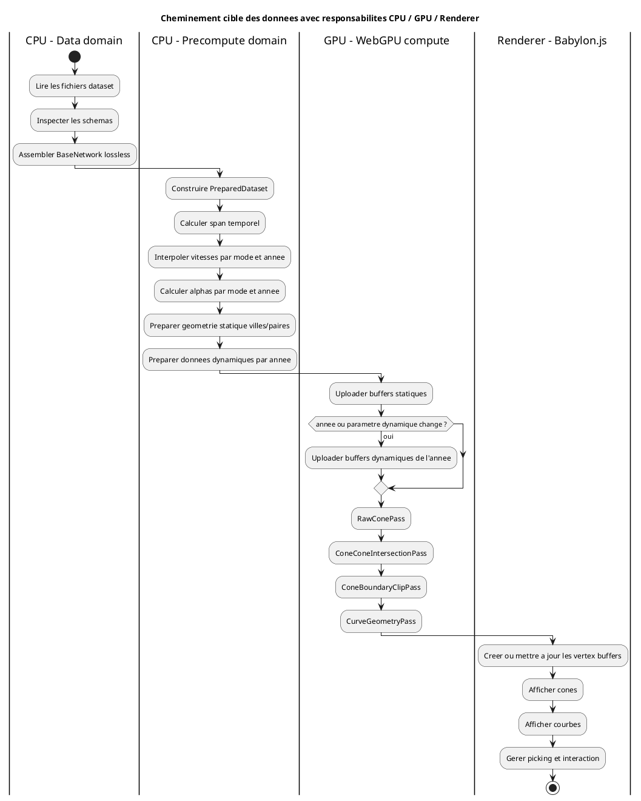
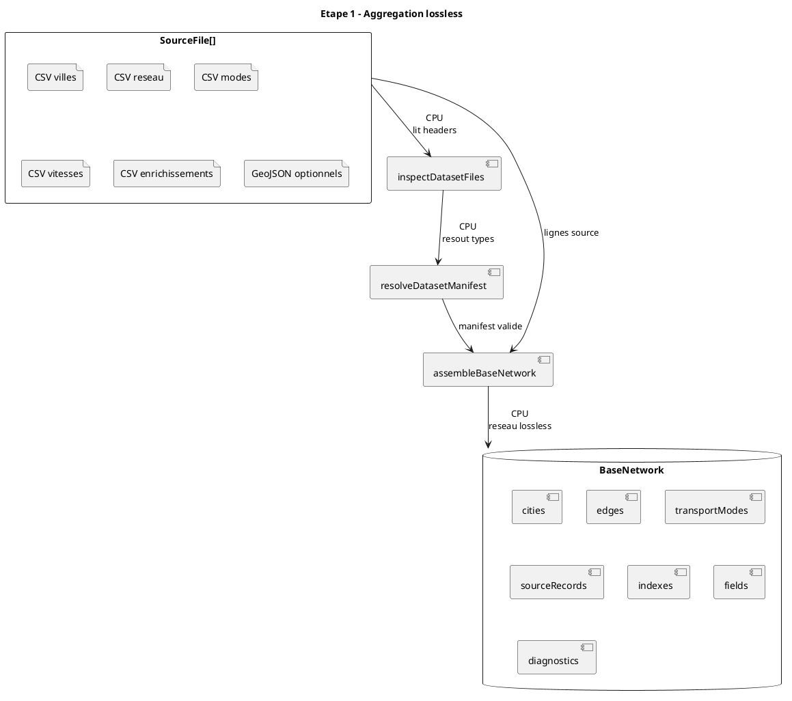
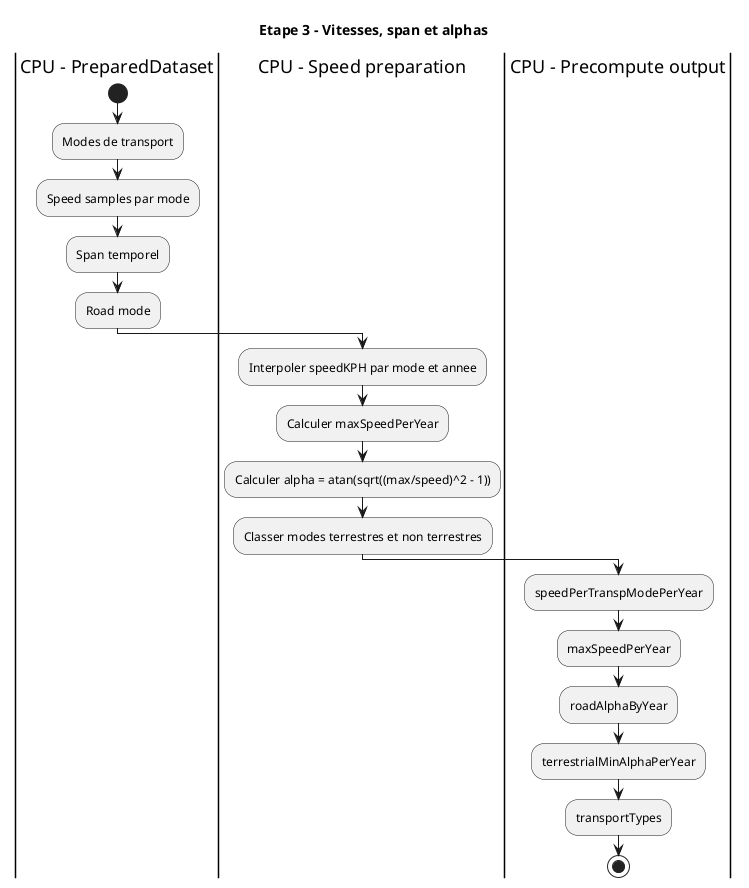
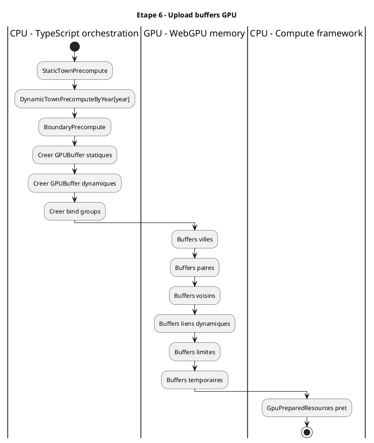
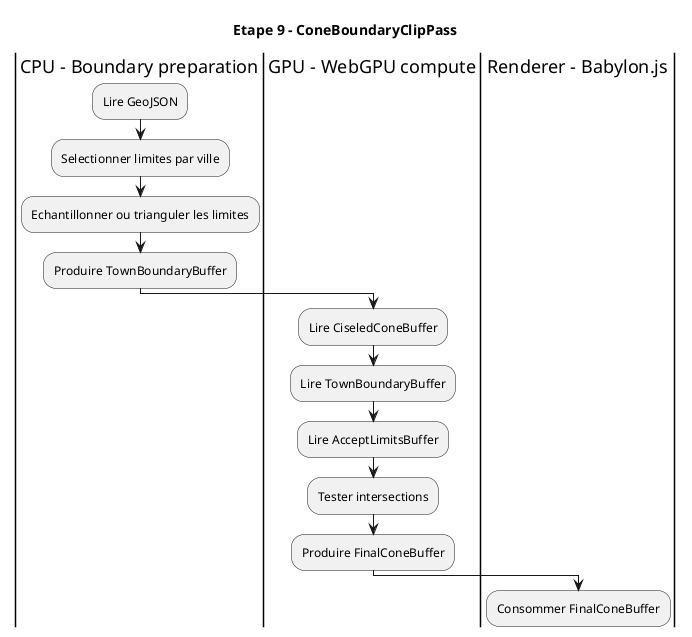
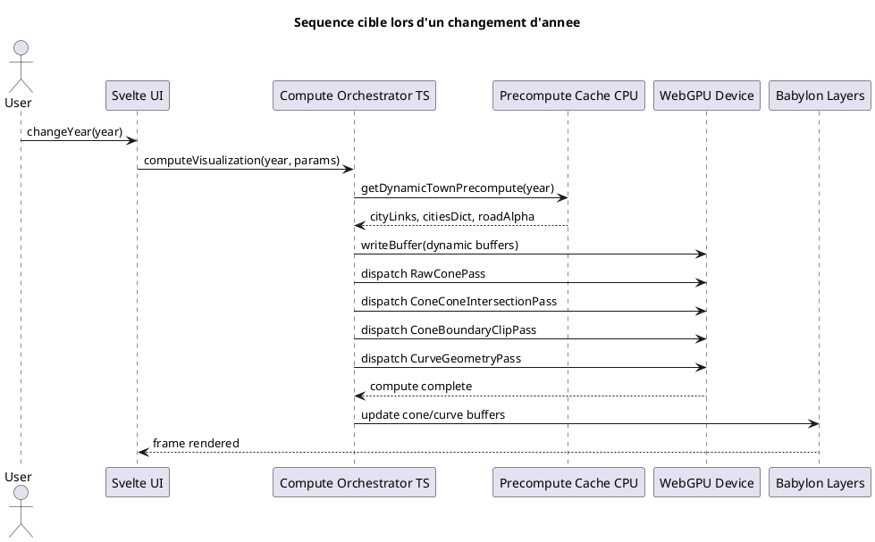
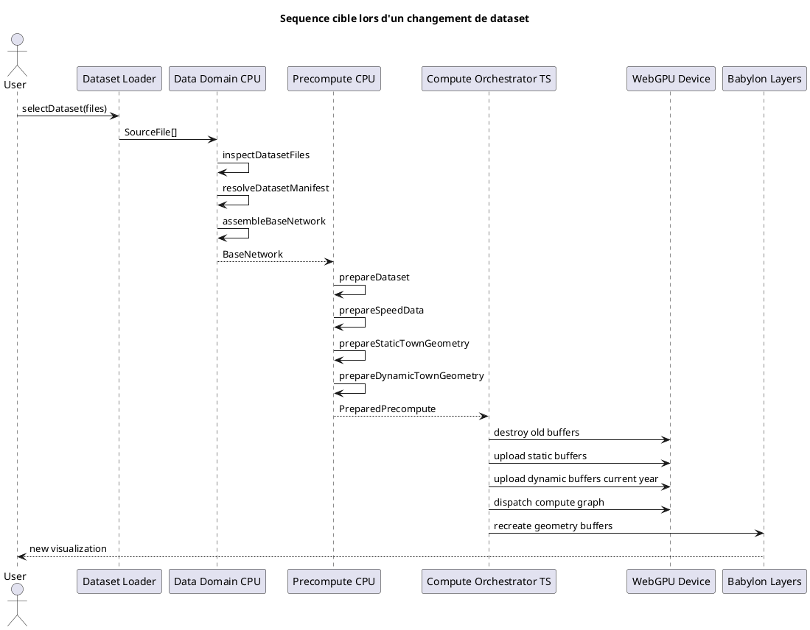

# Cheminement Des Donnees: Reseau Lossless, Precalcul, Compute Et Affichage

Ce document decrit le cheminement cible des donnees depuis l'agregation du reseau lossless jusqu'a l'affichage des cones et des courbes.

Il s'appuie sur trois bases:

- le module `src/lib/domain/data`, deja introduit dans la branche de migration;
- le `Merger` historique de `main`, qui contient la logique metier initiale;
- les helpers de `toBabylon`, notamment `reader.ts`, `speedHelper.ts`, `townHelper.ts` et `cone/mesher.ts`, qui formalisent mieux la phase de precalcul.

## Principe General

Le pipeline cible distingue quatre niveaux:

- `BaseNetwork`: reseau source assemble sans perte, encore proche des donnees CSV.
- `PreparedDataset`: donnees metier normalisees, indexees et compactees pour le calcul.
- `Precompute`: invariants statiques et donnees dynamiques par annee.
- `Compute/Render`: buffers GPU, passes compute WebGPU, puis affichage Babylon.js.

La regle de responsabilite est la suivante:

- le CPU lit, diagnostique, assemble, indexe et prepare les donnees;
- le GPU execute les calculs massivement paralleles sur des buffers compacts;
- le renderer consomme les resultats, mais ne doit pas porter la logique metier.

## Vue D'Ensemble Avec Lignes De Responsabilite



Dans cette architecture, un changement de dataset relance tout le pipeline. Un changement d'annee ne relance pas la lecture CSV ni l'assemblage lossless. Il selectionne seulement le paquet dynamique de l'annee et relance les passes GPU necessaires.

## Etape 1: Agregation Lossless Du Reseau

Responsable principal: CPU.

Entrees:

- fichiers CSV et GeoJSON du dataset;
- contenu texte des fichiers;
- colonnes caracteristiques reconnues par contrat;
- colonnes libres inconnues, conservees pour enrichissement et requetes.

Traitements:

- inspection de tous les fichiers sans presumer leur nom ni leur ordre;
- identification des tables primaires par colonnes caracteristiques;
- rattachement des fichiers contenant `cityCode` comme enrichissements de villes;
- construction des entites de base;
- conservation de toutes les lignes sources dans `SourceRecord`;
- creation des indexes de relation.

Sortie:

- `BaseNetwork`.



Points importants:

- cette etape ne calcule pas encore les cones;
- elle ne produit pas de buffers GPU;
- elle ne suppose aucun nom de colonne libre comme `population`;
- elle fournit la base queryable pour les requetes utilisateur.

## Etape 2: Preparation Metier Du Dataset

Responsable principal: CPU.

Entree:

- `BaseNetwork`.

Objectif:

Transformer le reseau lossless en donnees metier compactes, sans encore entrer dans les details GPU. C'est l'equivalent cible de la partie propre de `reader.ts` dans `toBabylon`.

Traitements:

- construire `cityMap`: `cityCode -> cityIndex`;
- nettoyer ou marquer les arcs non connectables;
- rattacher les arcs incidents aux villes;
- identifier le mode `Road`;
- calculer les distances geodesiques utiles;
- calculer le span temporel global;
- construire les listes de transport par type: modes terrestres pour cones, modes non terrestres pour courbes.

Sortie:

- `PreparedDataset`.

```plantuml
@startuml
title Etape 2 - BaseNetwork vers PreparedDataset

class BaseNetwork {
  cities
  edges
  transportModes
  sourceRecords
  indexes
  fields
}

class PreparedDataset {
  cityMap
  cities
  connectedEdges
  transportModes
  roadModeCode
  span
  transportTypes
  diagnostics
}

component "prepareDataset" as prepare

BaseNetwork --> prepare : entree CPU
prepare --> PreparedDataset : sortie CPU

note right of PreparedDataset
  Niveau metier normalise.
  Pas encore de WebGPU.
  Les colonnes libres restent
  referencees par sourceRecordId.
end note
@enduml
```

Ce niveau est necessaire pour ne pas melanger le contrat lossless avec les structures de calcul. `BaseNetwork` reste la verite source. `PreparedDataset` est une projection metier optimisee pour les etapes suivantes.

## Etape 3: Preparation Des Vitesses Et Des Alphas

Responsable principal: CPU.

Reference historique:

- `toBabylon/src/application/merger/speedHelper.ts`;
- logique equivalente dans `main/src/application/bigBoard/merger.ts`.

Entrees:

- modes de transport;
- vitesses connues par mode et par annee;
- span temporel;
- mode `Road`.

Traitements:

- interpolation des vitesses par mode pour chaque annee du span;
- calcul de `maxSpeedPerYear`;
- calcul de l'angle `alpha` par mode et par annee;
- separation modes terrestres / non terrestres;
- calcul de l'alpha terrestre minimal ou de l'alpha de reference route.

Sorties:

- `speedPerTranspModePerYear`;
- `maxSpeedPerYear`;
- `terrestrialMinAlphaPerYear`;
- `roadAlphaByYear`;
- `transportTypes`.



Cette etape est encore CPU car elle depend de peu de donnees et produit des tables temporelles compactes. Elle alimente ensuite les buffers dynamiques par annee.

## Etape 4: Precalcul Statique Des Villes Et Des Paires

Responsable principal cible: CPU dans un premier portage, GPU possible ensuite.

Reference historique:

- `toBabylon/src/application/merger/townHelper.ts`;
- shader `toBabylon/src/application/merger/shaders/city.frag`.

Entrees:

- villes preparees;
- longitude, latitude;
- rayon terrestre;
- nombre de secteurs voisins;
- limite maximale de voisins par ville.

Traitements:

- construire un referentiel local NED par ville;
- produire les matrices NED/ECEF;
- calculer pour chaque paire de villes:
  - azimut A vers B;
  - distance angulaire;
  - midpoint;
  - points de controle P et Q;
  - vecteur unitaire local A vers B;
  - elevation associee;
- construire `townOverlaps`, c'est-a-dire une selection bornee de voisins par secteurs angulaires.

Sortie:

- `StaticTownPrecompute`.

```plantuml
@startuml
title Etape 4 - Precalcul statique villes/paires

class PreparedDataset {
  cityMap
  cities
  connectedEdges
}

class StaticTownPrecompute {
  cityMap
  neighborLimit
  townOverlaps
  azDistMid
  pointPPointQ
  vUnitAndElevation
  citiesGlslDatas
}

component "prepareStaticTownGeometry" as staticPrep

PreparedDataset --> staticPrep : CPU\nvilles compactes
staticPrep --> StaticTownPrecompute : CPU aujourd'hui\nGPU possible ensuite

note right of StaticTownPrecompute
  Invariant tant que le dataset,
  le modele geodesique ou la strategie
  de voisinage ne changent pas.
end note
@enduml
```

Ce precalcul est un invariant fort. Il ne depend pas de l'annee. Il depend du dataset, du modele de terre et de la strategie de voisinage/intersection.

Dans `toBabylon`, une partie de ce calcul est deja faite via pseudo-compute WebGL. Pour la migration, je recommande de porter d'abord la version CPU pour avoir un resultat testable en Node, puis d'optimiser certaines parties avec WebGPU si necessaire.

## Etape 5: Precalcul Dynamique Par Annee

Responsable principal: CPU.

Reference historique:

- `toBabylon/src/application/merger/townHelper.ts`, `prepareDynamicTownGeometry`.

Entrees:

- `PreparedDataset`;
- `StaticTownPrecompute`;
- `speedPerTranspModePerYear`;
- `roadAlphaByYear`;
- arcs connectes;
- dates de debut/fin des arcs.

Traitements:

- pour chaque annee du span:
  - selectionner les arcs actifs;
  - conserver les arcs terrestres pour les cones;
  - convertir chaque destination en index compact;
  - recuperer l'azimut depuis `azDistMid`;
  - recuperer l'alpha du mode;
  - dedoublonner les transports multiples vers une meme destination;
  - trier les liens par azimut;
  - produire un tableau compact `cityLinks`;
  - produire un dictionnaire d'offsets `citiesDict`;
  - stocker `roadAlpha`.

Sortie:

- `DynamicTownPrecomputeByYear`.

```plantuml
@startuml
title Etape 5 - Precalcul dynamique par annee

class StaticTownPrecompute {
  cityMap
  azDistMid
}

class SpeedPrecompute {
  speedPerTranspModePerYear
  roadAlphaByYear
}

class DynamicTownPrecomputeByYear {
  year
  cityLinks
  citiesDict
  roadAlpha
}

component "prepareDynamicTownGeometry" as dynamicPrep

StaticTownPrecompute --> dynamicPrep : azimuts et cityMap
SpeedPrecompute --> dynamicPrep : alphas par mode/annee
dynamicPrep --> DynamicTownPrecomputeByYear : CPU\nun paquet par annee

note right of DynamicTownPrecomputeByYear
  Selectionne quand l'annee change.
  Ne relance pas l'aggregation dataset.
end note
@enduml
```

Le format historique `cityLinks` et `citiesDict` doit etre conserve dans l'esprit, mais reformalise:

- `cityLinks`: tableau plat de triplets, par exemple `[cityDestIndex, azimuth, alpha]`;
- `citiesDict`: offsets par ville, par exemple `[beginOffset, endOffset]`;
- les strides doivent etre explicitement documentes pour WebGPU.

## Etape 6: Upload Vers Les Buffers GPU

Responsable principal: TypeScript orchestration + GPU.

Entrees:

- `StaticTownPrecompute`;
- `DynamicTownPrecomputeByYear[year]`;
- parametres de calcul;
- limites geographiques preparees.

Traitements CPU:

- creer les `GPUBuffer`;
- ecrire les donnees statiques une fois;
- ecrire les donnees dynamiques quand l'annee change;
- creer les bind groups;
- selectionner les pipelines WGSL.

Traitements GPU:

- aucun calcul tant que les passes ne sont pas dispatch;
- les donnees sont seulement disponibles pour les kernels.

Sorties:

- `GpuPreparedResources`;
- bind groups prets pour les passes compute.



Les buffers statiques ne doivent pas etre recrees a chaque changement d'annee. Les buffers dynamiques peuvent etre remplaces ou mis a jour par `queue.writeBuffer`.

## Etape 7: Generation Des Cones Bruts

Responsable principal: GPU.

Reference historique:

- `toBabylon/src/application/cone/shaders/rawCones.frag`.

Entrees GPU:

- sommets ECEF des villes;
- matrices NED/ECEF;
- `cityLinks`;
- `citiesDict`;
- `roadAlpha`;
- longueur maximale des cones;
- attenuation angulaire.

Traitement:

- pour chaque ville et chaque azimut echantillonne:
  - trouver les alphas voisins de cet azimut;
  - interpoler ou lisser vers `roadAlpha`;
  - calculer la direction locale;
  - convertir en position ECEF;
  - produire un vertex de cone brut.

Sortie:

- `RawConeBuffer`.

```plantuml
@startuml
title Etape 7 - RawConePass

class GpuStaticBuffers {
  summitECEF
  ned2ECEF
}

class GpuDynamicBuffers {
  cityLinks
  citiesDict
  roadAlpha
}

class RawConeBuffer {
  positionECEF[city, azimuth]
}

component "RawConePass WGSL" as raw

GpuStaticBuffers --> raw
GpuDynamicBuffers --> raw
raw --> RawConeBuffer : GPU\nparallel city x azimuth
@enduml
```

Cette passe remplace le role de `rawCones.frag`. Elle est massivement parallele car chaque couple `(ville, azimut)` peut etre calcule independamment.

## Etape 8: Intersections Cone / Cone

Responsable principal: GPU.

Reference historique:

- `toBabylon/src/application/cone/shaders/ciseledCones.frag`.

Entrees GPU:

- `RawConeBuffer`;
- `townOverlaps`;
- `neighborLimit`;
- parametres d'ouverture de recherche.

Traitement:

- pour chaque vertex brut d'un cone A:
  - prendre la demi-droite sommet A -> vertex;
  - parcourir les cones voisins preselectionnes;
  - tester les triangles du cone voisin autour de l'azimut pertinent;
  - conserver l'intersection la plus proche du sommet A;
  - sinon conserver le vertex brut.

Sortie:

- `CiseledConeBuffer`.

```plantuml
@startuml
title Etape 8 - ConeConeIntersectionPass

class RawConeBuffer {
  raw vertices
}

class TownNeighborIndex {
  townOverlaps
  neighborLimit
}

class CiseledConeBuffer {
  intersected vertices
}

component "ConeConeIntersectionPass WGSL" as intersect

RawConeBuffer --> intersect
TownNeighborIndex --> intersect
intersect --> CiseledConeBuffer : GPU\nray/triangle tests

note right of intersect
  Le voisinage borne evite
  un cout O(n^2 * azimuths)
  non controle.
end note
@enduml
```

C'est la passe centrale a ameliorer. La qualite des intersections dependra de:

- la strategie de voisinage;
- la resolution angulaire;
- la robustesse numerique des tests rayon/triangle;
- la separation entre intersection cone/cone et clipping par limites.

## Etape 9: Clipping Par Limites Geographiques

Responsable principal: GPU, avec preparation CPU des limites.

Reference historique:

- `toBabylon/src/application/cone/shaders/finalCones.frag`;
- logique de limites dans `main/src/application/cone/coneMeshShader.ts`.

Entrees CPU:

- GeoJSON ou limites preparees;
- association ville -> limites pertinentes.

Entrees GPU:

- `CiseledConeBuffer`;
- `TownBoundaryBuffer`;
- `AcceptLimitsBuffer`.

Traitement:

- pour chaque vertex de cone:
  - verifier si la ville accepte le clipping;
  - tester l'intersection avec les triangles de limites;
  - remplacer le vertex par l'intersection la plus proche si necessaire.

Sortie:

- `FinalConeBuffer`.



Cette passe doit rester separee des intersections cone/cone. Les limites geographiques ne sont pas le meme probleme que l'intersection entre cones.

## Etape 10: Generation Des Courbes

Responsable principal: CPU pour les invariants, GPU pour les vertices.

Reference historique:

- `main/src/application/cone/curveMeshShader.ts`;
- donnees de courbes produites dans `networkFromCities`;
- esquisse `toBabylon` avec `pointPPointQ` et vitesses par mode/annee.

Entrees CPU invariantes:

- origine;
- destination;
- points de controle P et Q;
- theta;
- mode de transport;
- vitesses ou vitesses modelisees par annee;
- `maxSpeedPerYear`.

Entrees dynamiques:

- annee;
- position de courbe;
- nombre de points par courbe;
- projection.

Traitements:

- CPU:
  - preparer les points de controle et les tables temporelles;
  - calculer ou selectionner la hauteur de courbe par annee;
- GPU:
  - echantillonner `t`;
  - appliquer Bezier cubique;
  - appliquer hauteur;
  - produire les positions.

Sortie:

- `CurveVertexBuffer`.

```plantuml
@startuml
title Etape 10 - Courbes

class CurvePrecompute {
  beginCity
  endCity
  pointP
  pointQ
  theta
  speedByModeByYear
  maxSpeedPerYear
}

class CurveDynamicInput {
  year
  pointsPerCurve
  curvePosition
}

class CurveVertexBuffer {
  positions
}

component "CurveGeometryPass WGSL" as curves

CurvePrecompute --> curves : buffers statiques
CurveDynamicInput --> curves : uniforms ou buffers dynamiques
curves --> CurveVertexBuffer : GPU\nparallel curve x sample
@enduml
```

Les courbes peuvent suivre une migration progressive. Elles ne sont pas aussi avancees que les cones dans `toBabylon`, mais les invariants sont deja presents: points P/Q, midpoint, theta et vitesses par annee.

## Etape 11: Affichage Babylon.js

Responsable principal: renderer.

Entrees:

- `FinalConeBuffer`;
- `CurveVertexBuffer`;
- index buffers;
- donnees de picking;
- metadata ville/source si necessaire.

Traitements:

- creer ou mettre a jour les vertex buffers Babylon;
- affecter les materiaux;
- gerer visibilite, selection, highlighting;
- synchroniser l'UI avec l'etat de calcul.

Sorties:

- meshes visibles;
- interactions utilisateur.

```plantuml
@startuml
title Etape 11 - Affichage

class FinalConeBuffer {
  positions
  uv
  cityId
}

class CurveVertexBuffer {
  positions
  curveId
}

component "Babylon ConeLayer" as cones
component "Babylon CurveLayer" as curves
component "Interaction Layer" as interaction

FinalConeBuffer --> cones : GPUBuffer ou TypedArray
CurveVertexBuffer --> curves : GPUBuffer ou TypedArray
cones --> interaction : picking cityId
curves --> interaction : picking curveId
@enduml
```

Babylon ne doit pas recalculer les intersections. Son role est de representer les donnees finales et d'exposer les interactions.

## Sequence Complete De Changement D'Annee



Le point important: `BaseNetwork`, `PreparedDataset` et `StaticTownPrecompute` ne changent pas pendant cette sequence.

## Sequence Complete De Changement De Dataset



Ici, tout est reconstruit car les invariants dependent du dataset.

## Matrice Des Responsabilites

| Etape | Acteur principal | Entree | Sortie | Relancee quand |
| --- | --- | --- | --- | --- |
| Inspection dataset | CPU | `SourceFile[]` | `DatasetManifest` | dataset change |
| Assemblage lossless | CPU | fichiers + manifest | `BaseNetwork` | dataset change |
| Preparation metier | CPU | `BaseNetwork` | `PreparedDataset` | dataset change |
| Preparation vitesses | CPU | modes + vitesses | speed/alpha tables | dataset change ou modele vitesse change |
| Precalcul statique villes | CPU puis GPU possible | villes | `StaticTownPrecompute` | dataset ou modele geodesique change |
| Precalcul dynamique annuel | CPU | arcs + alphas + statique | `DynamicTownPrecomputeByYear` | dataset, span, mode vitesse ou strategie cone change |
| Upload buffers statiques | CPU/TS + GPU memory | statique | buffers GPU | dataset/precalcul statique change |
| Upload buffers dynamiques | CPU/TS + GPU memory | annee | buffers GPU dynamiques | annee ou parametre dynamique change |
| Raw cones | GPU | statique + dynamique | `RawConeBuffer` | annee, cone shape, longueur, attenuation |
| Intersections cone/cone | GPU | raw cones + voisins | `CiseledConeBuffer` | raw cones ou strategie intersection change |
| Clipping limites | GPU | ciseled + limites | `FinalConeBuffer` | limites, acceptation limites, ciseled |
| Courbes | GPU avec invariants CPU | controles + annee | `CurveVertexBuffer` | annee, position courbe, resolution |
| Affichage | Babylon.js | buffers finaux | meshes visibles | resultats compute ou style change |

## Synthese

La chaine mature a conserver est:

```text
BaseNetwork
  -> PreparedDataset
  -> SpeedPrecompute
  -> StaticTownPrecompute
  -> DynamicTownPrecomputeByYear
  -> GpuPreparedResources
  -> RawConeBuffer
  -> CiseledConeBuffer
  -> FinalConeBuffer
  -> Babylon meshes
```

Le framework WebGPU ne doit pas remplacer le precalcul metier. Il doit l'executer a partir de structures compactes, stables et documentees.

La prochaine etape de migration doit donc etre la formalisation TypeScript de `PreparedDataset`, `StaticTownPrecompute` et `DynamicTownPrecomputeByYear`, en reprenant la logique mature de `toBabylon` avant de porter les passes en WGSL.
