# Cheminement Des Donnees: Reseau Lossless, Precalcul, Compute Et Affichage

Ce document decrit le cheminement cible des donnees depuis l'agregation du reseau lossless jusqu'a l'affichage des cones et des courbes.

Il s'appuie sur trois bases:

- le module `src/lib/domain/data`, deja introduit dans la branche de migration;
- le `Merger` historique de `main`, qui contient la logique metier initiale;
- les helpers de `toBabylon`, notamment `reader.ts`, `speedHelper.ts`, `townHelper.ts` et `cone/mesher.ts`, qui formalisent mieux la phase de precalcul.

## Principe General

Le pipeline cible distingue quatre niveaux:

- `BaseNetwork`: reseau source assemble sans perte, encore proche des donnees CSV.
- `PreparedDataset`: donnees metier normalisees, indexees et compactees pour le calcul.
- `Precompute`: invariants statiques et donnees dynamiques par annee.
- `Compute/Render`: buffers GPU, passes compute WebGPU, puis affichage Babylon.js.

La regle de responsabilite est la suivante:

- le CPU lit, diagnostique, assemble, indexe et prepare les donnees;
- le GPU execute les calculs massivement paralleles sur des buffers compacts;
- le renderer consomme les resultats, mais ne doit pas porter la logique metier.

## Vue D'Ensemble Avec Lignes De Responsabilite

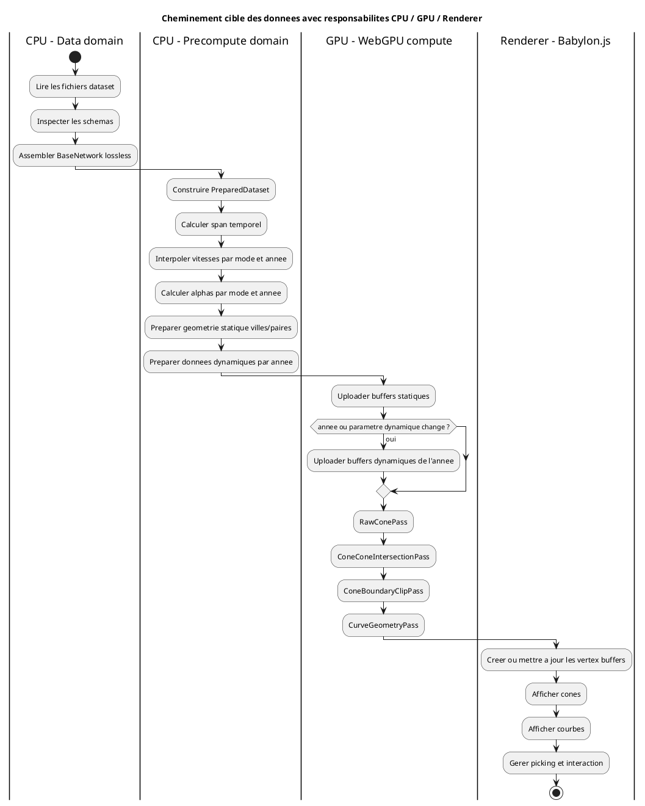
```plantuml
@startuml
title Cheminement cible des donnees avec responsabilites CPU / GPU / Renderer

|CPU - Data domain|
start
:Lire les fichiers dataset;
:Inspecter les schemas;
:Assembler BaseNetwork lossless;

|CPU - Precompute domain|
:Construire PreparedDataset;
:Calculer span temporel;
:Interpoler vitesses par mode et annee;
:Calculer alphas par mode et annee;
:Preparer geometrie statique villes/paires;
:Preparer donnees dynamiques par annee;

|GPU - WebGPU compute|
:Uploader buffers statiques;
if (annee ou parametre dynamique change ?) then (oui)
  :Uploader buffers dynamiques de l'annee;
endif
:RawConePass;
:ConeConeIntersectionPass;
:ConeBoundaryClipPass;
:CurveGeometryPass;

|Renderer - Babylon.js|
:Creer ou mettre a jour les vertex buffers;
:Afficher cones;
:Afficher courbes;
:Gerer picking et interaction;

stop
@enduml
```

Dans cette architecture, un changement de dataset relance tout le pipeline. Un changement d'annee ne relance pas la lecture CSV ni l'assemblage lossless. Il selectionne seulement le paquet dynamique de l'annee et relance les passes GPU necessaires.

Schemas PNG:

- 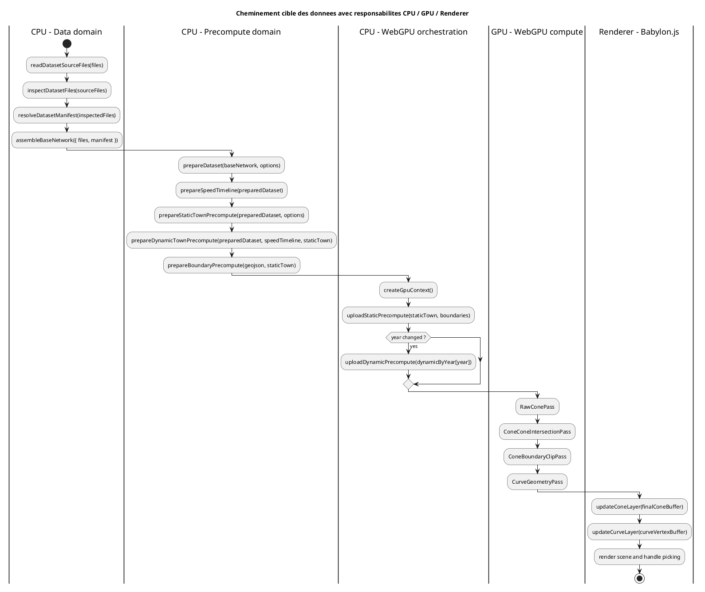
- 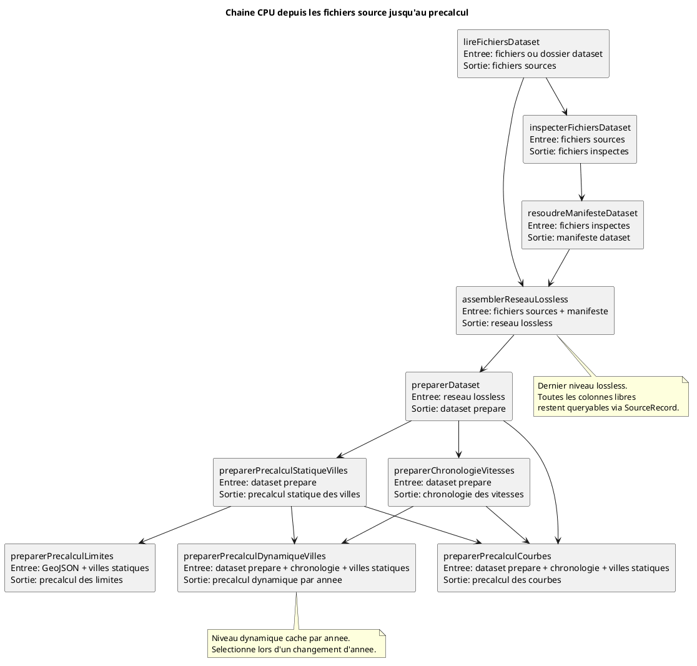
- 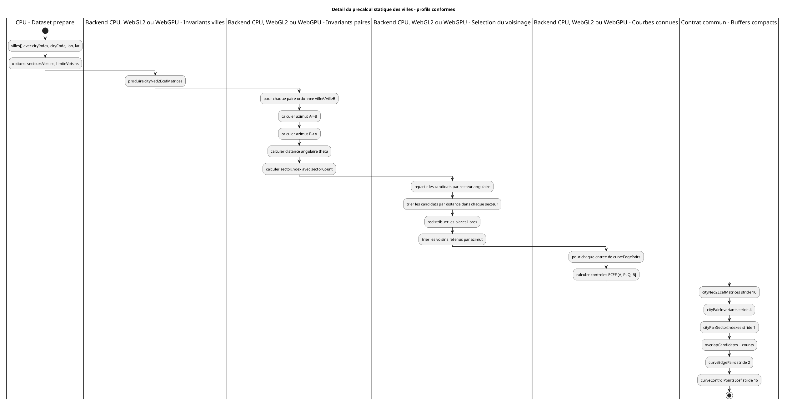
- 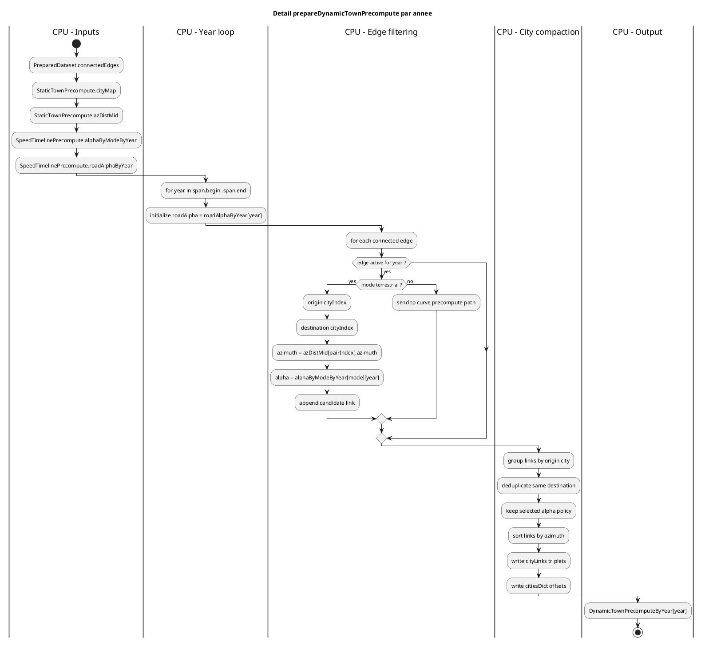
- 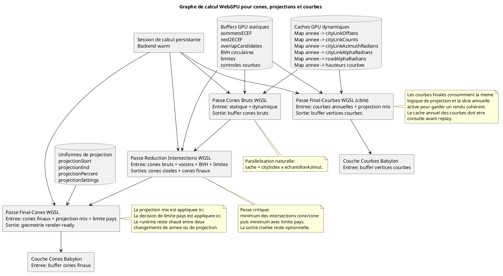
- 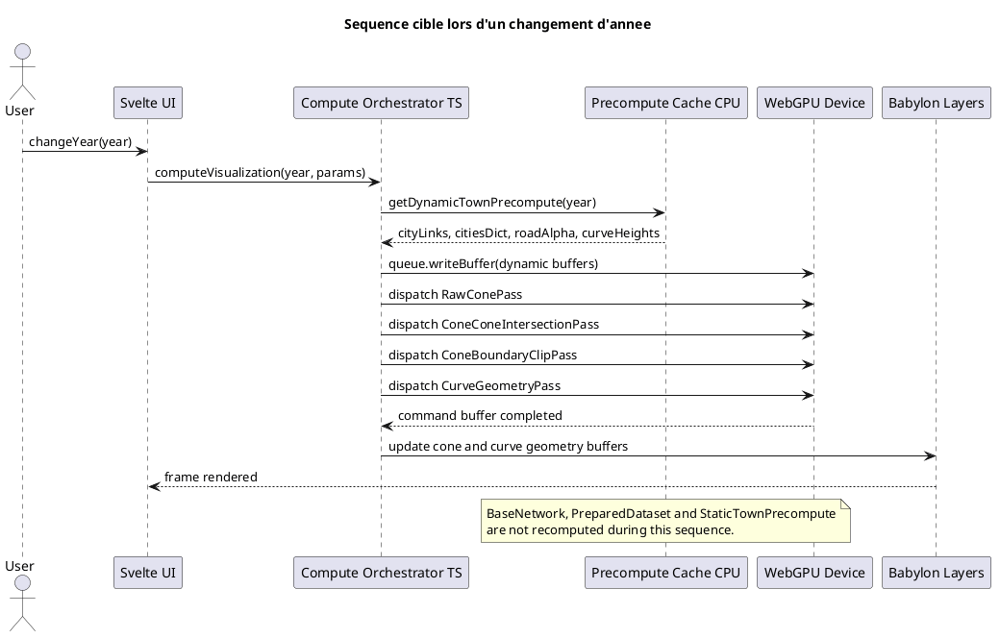
- 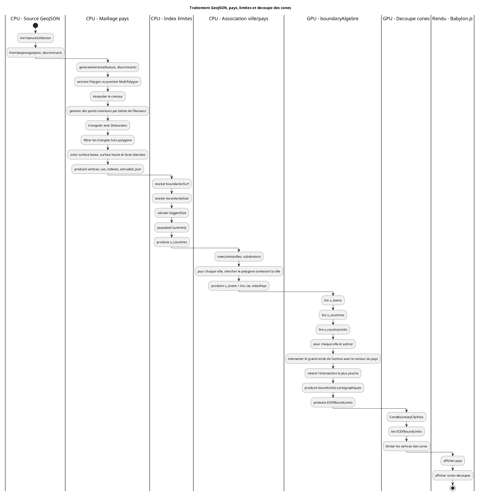
- 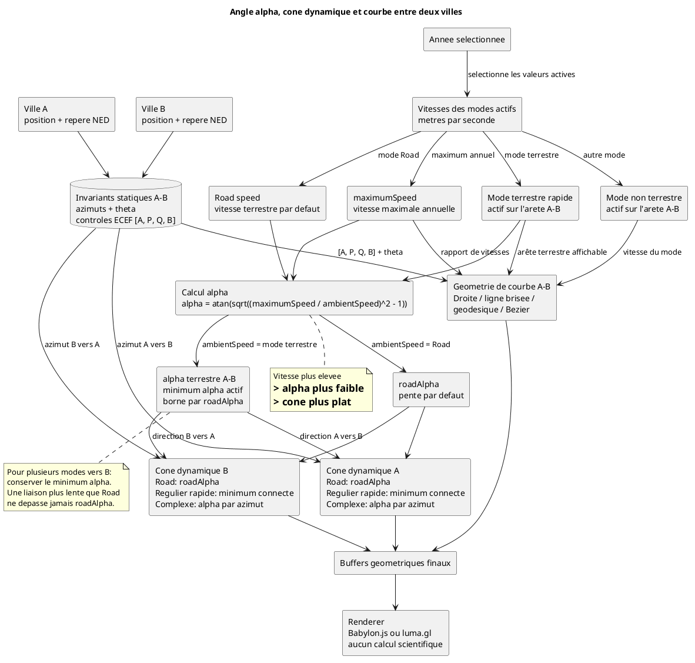

Sources PlantUML:

- `docs/diagrams/precompute/01-responsibilities.puml`
- `docs/diagrams/precompute/02-cpu-function-chain.puml`
- `docs/diagrams/precompute/03-static-town-precompute.puml`
- `docs/diagrams/precompute/04-dynamic-town-precompute.puml`
- `docs/diagrams/precompute/05-webgpu-compute-graph.puml`
- `docs/diagrams/precompute/06-change-year-sequence.puml`
- `docs/diagrams/precompute/07-geojson-boundaries.puml`
- `docs/diagrams/precompute/08-alpha-dynamic-cones-curves.puml`

## Enchainement Detaille Des Fonctions

Cette section decrit la chaine fonctionnelle cible. Les noms proposes sont des noms de migration; ils doivent rester proches des responsabilites historiques de `Merger`, `speedHelper`, `townHelper` et `mesher`, mais avec des contrats explicites et testables.

### 1. Lecture Et Inspection

Fonction: `readDatasetSourceFiles(input)`

- Acteur: CPU.
- Entree: dossier dataset, liste de fichiers selectionnes par l'utilisateur, archive dataset deployee, ou API Tauri plus tard.
- Transformation: lit chaque fichier texte supporte et conserve son nom original.
- Sortie: `SourceFile[]`, avec `{ name, text }`.
- Contrainte: l'ordre de sortie peut etre stable pour les rapports, mais aucune fonction metier ne doit en dependre.

Fonction: `inspectDatasetFiles(sourceFiles)`

- Acteur: CPU.
- Entree: `SourceFile[]`.
- Transformation: parse uniquement les headers CSV ou le type JSON; detecte le type par colonnes caracteristiques.
- Sortie: `InspectedDatasetFile[]`.
- Diagnostics: fichier inconnu, extension non supportee, JSON invalide, signature ambigue.
- Contrainte: les colonnes non caracteristiques ne sont pas interpretees.

Fonction: `resolveDatasetManifest(inspectedFiles)`

- Acteur: CPU.
- Entree: `InspectedDatasetFile[]`.
- Transformation: regroupe les fichiers primaires, les enrichissements `cityCode`, les GeoJSON et les inconnus.
- Sortie: `DatasetManifest`.
- Diagnostics bloquants: table primaire manquante, table primaire multiple.
- Diagnostics non bloquants: fichier inconnu conserve pour rapport.

### 2. Assemblage Lossless

Fonction: `assembleBaseNetwork({ files, manifest })`

- Acteur: CPU.
- Entree: `SourceFile[]` et `DatasetManifest` valide.
- Transformation:
  - parse les fichiers primaires avec PapaParse;
  - cree un `SourceRecord` pour chaque ligne;
  - extrait les colonnes caracteristiques;
  - conserve toutes les autres colonnes dans `extra` et `raw`;
  - cree les villes de base;
  - cree les arcs de base;
  - cree les modes de transport de base;
  - indexe `cityCode`, modes, vitesses et arcs incidents;
  - rattache les fichiers d'enrichissement aux villes via `cityCode`.
- Sortie: `BaseNetwork`.
- Diagnostics: cityCode duplique, mode duplique, references manquantes, nombres caracteristiques invalides.
- Invariant: aucune colonne source n'est perdue.

Sortie attendue:

```ts
interface BaseNetwork {
  cities: BaseCity[];
  edges: BaseEdge[];
  transportModes: BaseTransportMode[];
  sourceRecords: SourceRecord[];
  indexes: BaseNetworkIndexes;
  fields: QueryableField[];
  diagnostics: DatasetDiagnostic[];
}
```

### 3. Preparation Metier Compacte

Fonction cible: `prepareDataset(baseNetwork, options)`

- Acteur: CPU.
- Entree: `BaseNetwork`.
- Transformation:
  - cree `cityMap: Map<cityCode, cityIndex>`;
  - transforme les ids internes en indexes denses utilisables en tableaux;
  - filtre ou marque les arcs dont l'origine ou la destination est absente;
  - rattache les arcs incidents a chaque ville;
  - identifie le mode `Road`;
  - calcule ou verifie `distCrowKM`;
  - calcule le diametre geodesique du dataset si necessaire au ratio de hauteur;
  - conserve les references vers `sourceRecordId` pour requetes et picking.
- Sortie: `PreparedDataset`.
- Diagnostics: `Road` manquant, arc non connectable, vitesse absente pour un mode utilise.
- Point de vigilance: `PreparedDataset` n'est pas lossless; il reference le lossless.

Sortie attendue:

```ts
interface PreparedDataset {
  baseNetwork: BaseNetwork;
  cityMap: Map<number, number>;
  cities: PreparedCity[];
  connectedEdges: PreparedEdge[];
  transportModes: PreparedTransportMode[];
  roadModeCode: number;
  span?: YearSpan;
  diagnostics: DatasetDiagnostic[];
}
```

### 4. Span Temporel Et Vitesses

Fonction cible: `prepareSpeedTimeline(baseNetwork, options)`

- Acteur: CPU.
- Entree: `BaseNetwork` lossless.
- Equivalent historique:
  - `identifyingRoadMode(transportModes)`;
  - `historicalTimeSpan(result)`;
  - `setSpeedDatas(result)`.
- Principe de migration:
  - ne pas muter `BaseNetwork`;
  - conserver les valeurs source dans `SourceRecord`;
  - produire une structure preparee dediee, orientee calcul;
  - appliquer les unites SI dans les sorties preparees.

Fonction: `identifyRoadMode(baseNetwork, options)`

- Source:
  - `transportModes.characteristic.name`;
  - `transportModes.characteristic.code`;
  - `transportModes.characteristic.terrestrial`.
- Transformation:
  - normalise le nom par `trim().toLowerCase()`;
  - cherche exactement un mode nomme `road`;
  - verifie que ce mode est terrestre.
- Sortie:
  - `roadModeId`;
  - `roadModeCode`.
- Diagnostics:
  - `road-mode-missing` si aucun mode `Road` n'existe;
  - `road-mode-ambiguous` si plusieurs modes `Road` existent;
  - `road-mode-not-terrestrial` si `Road` n'est pas terrestre.
- Divergence volontaire:
  - `toBabylon` utilise `modeName === 'Road'` et ne signale pas les erreurs;
  - la migration rend la regle robuste et explicite.

Fonction: `computeTransportModeTimeBounds(baseNetwork, roadReference)`

- Source:
  - annees `year` des records `transportModeSpeeds`;
  - annees optionnelles `eYearBegin` et `eYearEnd` des records `transportNetwork`;
  - liens edge -> mode deja etablis dans `BaseNetwork`.
- Transformation:
  - calcule `speedYearBegin` et `speedYearEnd` depuis les vitesses connues;
  - calcule `edgeYearBegin` et `edgeYearEnd` depuis les arcs;
  - si au moins un arc d'un mode n'a pas `eYearBegin`, alors `edgeYearBegin = null`;
  - si au moins un arc d'un mode n'a pas `eYearEnd`, alors `edgeYearEnd = null`;
  - calcule `yearBegin = max(speedYearBegin, edgeYearBegin ou -Infinity)`;
  - calcule `yearEnd = min(speedYearEnd, edgeYearEnd ou Infinity)`.
- Sortie:
  - timeline par mode;
  - periodes valides par mode.
- Diagnostics:
  - mode sans vitesse;
  - vitesse invalide ou negative;
  - periode de mode vide;
  - mode non-road sans edge.
- Point de coherence:
  - `Road` peut ne pas etre present dans le reseau d'arcs; c'est l'exception documentee, car il porte la surface des cones.

Fonction: `computeHistoricalTimeSpan(timelines, roadReference)`

- Source:
  - timelines des modes;
  - reference `Road`.
- Transformation:
  - calcule d'abord l'etendue des modes non-road;
  - restreint cette etendue par la disponibilite de `Road`;
  - exige une periode non vide.
- Sortie:
  - `{ beginYear, endYear }`.
- Diagnostics:
  - aucun mode non-road exploitable;
  - span global vide;
  - road indisponible sur la periode differentielle.
- Point a documenter:
  - la documentation utilisateur indique qu'un `yearEndRoad` vide peut etre peuple avec l'annee courante;
  - le code historique borne en pratique par les annees de vitesses;
  - le premier portage suit le code historique et signale cette decision.

Fonction: `prepareSpeedTimeline(baseNetwork, options)`

- Source:
  - `transportModes`;
  - `transportModeSpeeds`;
  - `transportNetwork`.
- Transformation:
  - identifie `Road`;
  - calcule les bornes temporelles des modes;
  - calcule le span historique global;
  - trie les vitesses par mode et par annee;
  - convertit `speedKPH` source en `speedMetersPerSecond`;
  - interpole lineairement les vitesses par annee entiere;
  - calcule `maxSpeedMetersPerSecondByYear`;
  - calcule `alphaRadians = atan(sqrt((maxSpeed / speed) ^ 2 - 1))`;
  - calcule `terrestrialMinAlphaRadiansByYear`;
  - separe les modes en `cones` et `curves`.
- Sortie: `PreparedSpeedTimeline`.
- Diagnostics:
  - `road-mode-*`;
  - `transport-mode-without-speed`;
  - `transport-mode-invalid-speed`;
  - `transport-mode-empty-period`;
  - `non-road-mode-without-edge`;
  - `historical-span-empty`;
  - `speed-interpolation-impossible`;
  - `speed-alpha-not-finite`.

Sortie attendue:

```ts
interface PreparedSpeedTimeline {
  roadModeId: number;
  roadModeCode: number;
  span: { beginYear: number; endYear: number };
  modes: PreparedTransportModeTimeline[];
  transportTypes: {
    cones: number[];
    curves: number[];
  };
  speedByModeByYear: Record<string, Record<string, {
    speedMetersPerSecond: number;
    alphaRadians: number;
  }>>;
  maxSpeedMetersPerSecondByYear: Record<string, number>;
  terrestrialMinAlphaRadiansByYear: Record<string, number>;
  diagnostics: DatasetDiagnostic[];
}
```

### 5. Precalcul Statique Des Villes

Fonction cible: `prepareStaticTownPrecompute(preparedDataset, options)`

- Acteur: backend CPU de reference ou backend GPU de production.
- Entree: `PreparedDataset`, rayon terrestre, nombre de secteurs, limite de voisins.
- Transformation:
  - produit les matrices `cityNed2EcefMatrices`;
  - calcule toutes les paires ordonnees ville A vers ville B;
  - calcule azimuts, distance angulaire et index de secteur;
  - repartit les voisins par secteur angulaire;
  - selectionne un nombre borne de voisins par ville pour les intersections;
  - calcule `[A, P, Q, B]` uniquement pour les arêtes connues.
- Sortie: `StaticTownPrecompute`.
- Diagnostics: cityCode duplique, ville invalide, voisinage incomplet.
- Invalidation: dataset different, modele geodesique different, resolution/strategie de voisinage differente.

Sortie attendue:

```ts
interface StaticTownPrecompute {
  cityCount: number;
  cityNed2EcefMatrices: Float32Array;
  cityPairInvariants: Float32Array;
  cityPairSectorIndexes: Uint32Array;
  overlapCandidates: Uint32Array;
  overlapCandidateCounts: Uint32Array;
  curveEdgePairs: Uint32Array;
  curveControlPointsEcef: Float32Array;
}
```

Strides valides:

- `cityNed2EcefMatrices`: stride 16, matrice colonne-major par ville.
- `cityPairInvariants`: stride 4,
  `[forwardAzimuthRadians, reverseAzimuthRadians, angularDistanceRadians, 0]`.
- `cityPairSectorIndexes`: stride 1.
- `curveEdgePairs`: stride 2, `[originCityIndex, destinationCityIndex]`.
- `curveControlPointsEcef`: stride 16, quatre `vec4<f32>` pour `[A, P, Q, B]`.

### 6. Precalcul Dynamique Par Annee

Fonctions CPU implementees:

- `computeDynamicTownPrecomputeForYearCpu(preparedDataset, staticTown, year)`;
- `computeDynamicTownPrecomputeByYearCpu(preparedDataset, staticTown)`.

- Acteur: CPU.
- Entree: `PreparedDataset`, `SpeedTimelinePrecompute`, `StaticTownPrecompute`.
- Transformation:
  - parcourt chaque annee du span;
  - selectionne les arcs actifs pour l'annee;
  - ignore les arcs non terrestres dans la construction des cones;
  - transforme origin/destination en indexes denses;
  - recupere l'azimut A vers B dans `cityPairInvariants`;
  - recupere l'alpha du mode pour l'annee;
  - regroupe par ville origine;
  - dedoublonne les liens vers une meme ville destination;
  - trie chaque liste par azimut;
  - compacte les liens dans un tableau plat;
  - cree un dictionnaire d'offsets par ville.
- Sortie: `DynamicTownPrecomputeByYear`.
- Diagnostics: arc actif sans alpha, mode absent, offsets incoherents.
- Invalidation: dataset, span, modele de vitesse ou strategie de cone.

Sortie attendue:

```ts
interface DynamicTownPrecompute {
  year: number;
  roadAlphaRadians: number;
  cityLinkOffsets: Uint32Array;
  cityLinkCounts: Uint32Array;
  cityLinkDestinationIndexes: Uint32Array;
  cityLinkAzimuthRadians: Float32Array;
  cityLinkAlphaRadians: Float32Array;
  cityFastestTerrestrialAlphaRadians: Float32Array;
}

type DynamicTownPrecomputeByYear = Record<string, DynamicTownPrecompute>;
```

Les valeurs sont stockees dans des tableaux separes pour permettre un acces
direct et des uploads GPU selectifs. Une ville sans lien utilise `count = 0`;
aucune sentinelle ni case vide n'est necessaire.

`PreparedDataset` porte egalement `edgeYearBegins` et `edgeYearEnds` sous forme
de `Int32Array`. Les années absentes utilisent des sentinelles non bornees
explicites, ce qui evite de relire les records lossless pendant les boucles
intensives.

### 7. Precalcul Des Courbes

Fonction cible: `prepareCurvePrecompute(preparedDataset, speedTimeline, staticTown)`

- Acteur: CPU.
- Entree: arcs connectes, modes non terrestres et eventuellement modes
  terrestres affichables comme courbes, `curveEdgePairs`,
  `curveControlPointsEcef`, theta et vitesses.
- Transformation:
  - dedoublonne les courbes par origine/destination/mode;
  - recupere les points de controle `[A, P, Q, B]` dans
    `curveControlPointsEcef`;
  - conserve `theta`;
  - calcule la vitesse modelisee par annee avec `getModelledSpeed`;
  - conserve `maxSpeedPerYear` pour calculer la hauteur de courbe.
- Sortie: `CurvePrecompute`.
- Diagnostics: point de controle absent, vitesse annuelle absente, theta invalide.

Sortie attendue:

```ts
interface CurvePrecompute {
  curves: PreparedCurve[];
  controls: Float32Array;
  speedRatioByCurveByYear: Record<string, Float32Array>;
}
```

### 8. Precalcul Des Limites

Fonction cible: `prepareBoundaryPrecompute(geojson, preparedDataset, staticTown, options)`

- Acteur: CPU.
- Entree: GeoJSON, villes, referentiels locaux, options de resolution.
- Transformation:
  - reprend le role de `fromGeojson` pour initialiser les polygones pays;
  - reprend le role de `generateVertices` pour produire la geometrie de rendu des pays;
  - conserve uniquement les frontieres de premier niveau;
  - ignore volontairement les trous et limites internes, par exemple les lacs;
  - conserve la densification du contour;
  - conserve la generation de points interieurs par lattice de Fibonacci;
  - conserve une triangulation de l'ensemble contour densifie + points interieurs;
  - filtre les triangles dont le point representatif sort du contour;
  - conserve les contours utilises par les tests point-dans-polygone;
  - construit `countryContourBuffer` en radians et `countryContourNVectors` pour les calculs intensifs;
  - conserve `boundariesSize` pour connaitre la taille reelle de chaque contour dans le tableau compacte;
  - associe chaque ville a un polygone de pays avec la logique de `townLimits`;
  - produit `cityContourIndexes`, dans le meme ordre que les villes issues de l'ingestion CSV;
  - consomme plus tard `cityNed2EcefMatrices` a la place de l'ancien `u_towns`;
  - prepare les entrees de la future passe WebGPU equivalente a `boundaryAlgebre.frag`;
  - construit un buffer de limites indexe par ville et azimut.
- Sortie: `BoundaryPrecompute`.
- Diagnostics: GeoJSON invalide, ville sans limite, limite trop peu echantillonnee.

Decisions validees:

- Les trous des polygones ne sont pas traites. L'application a besoin de la frontiere externe d'un pays ou d'un continent, pas des limites internes.
- Pour les `MultiPolygon`, chaque contour externe de premier niveau doit devenir un contour exploitable. Il ne faut pas se limiter au premier polygone si plusieurs morceaux representent une meme entite.
- Le maillage interne est obligatoire pour une representation 3D correcte sur sphere. Une triangulation limitee au seul contour produirait des grands triangles qui representent mal la courbure.
- `Earcut` seul n'est donc pas retenu comme remplacement principal: il triangule les points fournis, mais ne genere pas les points internes necessaires au rendu 3D.
- L'approche de `toBabylon` reste la base: contour densifie + points interieurs par Fibonacci + triangulation + filtrage des triangles hors contour.
- `Delaunator` reste coherent avec cette approche car il triangule efficacement un nuage de points 2D. La correction geometrique vient ensuite du filtrage par appartenance au contour.
- Un test point-dans-polygone reste necessaire pour filtrer les triangles et associer les villes aux contours. Le premier portage utilise une implementation interne par crossing-number; Turf reste acceptable si l'on veut le reintegrer plus tard.
- Le parametre historique `subdivision` sera remplace par un parametre explicite `azimuthSampleCount`.

Fonctions historiques concernees:

- `src/application/country/geojson2preVertex.ts` dans `toBabylon`;
- `fromGeojson(geoJson, discriminant)`;
- `generateVertices(feature, discriminant)`;
- `townLimits(towns, subdivision)`;
- `boundaryAlgebre.frag`.

Sortie attendue:

```ts
interface CountryRenderPreGeometry {
  vertices: Float32Array;
  uvs: Float32Array;
  indexes: Uint16Array;
  extruded: { begin: number; end: number };
  sourceFeatureId: number;
  sourceContourId: number;
}

interface BoundaryPrecompute {
  countryGeometries: CountryRenderPreGeometry[];
  contours: CountryContour[];
  countryContourBuffer: Float32Array;
  countryContourSizes: Int32Array;
  townCountryIndexes: Int32Array;
  azimuthSampleCount: number;
  diagnostics: BoundaryDiagnostic[];
}
```

Options cible:

```ts
interface BoundaryPrecomputeOptions {
  contourMaxSegmentRadians: number;
  interiorPointSpacingRadians: number;
  azimuthSampleCount: number;
  countryExtrusionHeightMeters: number;
}
```

Strides a formaliser:

- `countryContourBuffer`: stride 2, `[longitudeRadians, latitudeRadians]`.
- `countryContourNVectors`: stride 4, `[x, y, z, padding]`, derive de `countryContourBuffer` pour eviter de refaire `ToNVector` dans les shaders.
- `cityNed2EcefMatrices`: stride 16, matrice `NED2ECEF` par ville, dans l'ordre stable produit par l'ingestion CSV.
- `cityContourIndexes`: stride 1, index du contour associe a chaque ville, dans le meme ordre que `cityNed2EcefMatrices`.
- `azimuthIntervals`: stride 2, `[minRadians, maxRadians]`; les intervalles sont continus et peuvent sortir de `[0, 2PI]`, par exemple `[-1 deg, 1 deg]` converti en radians.
- `townBoundaryAngular`: sortie par ville et intervalle d'azimut, stride 4, `[longitudeRadians, latitudeRadians, angularDistanceRadians, validIntersection]`.
- `townBoundaryEcef`: sortie par ville et intervalle d'azimut, stride 4, `[xMeters, yMeters, zMeters, validIntersection]`.

Regle d'unites:

- les donnees internes sont exprimees en systeme international;
- les angles internes sont exprimes en radians;
- les distances internes sont exprimees en metres;
- les coordonnees GeoJSON en degres sont converties en radians a la frontiere d'import;
- aucune conversion degres/radians ne doit rester dans le coeur de calcul ni dans les shaders WGSL;
- les degres ne sont utilises que pour l'entree humaine, l'affichage humain ou la lecture de formats externes.

Point important:

Le traitement GeoJSON a deux sorties distinctes et il ne faut pas les confondre:

- une sortie de rendu pays, equivalente a `IPreGeometry`, consommee par la couche pays;
- une sortie de limites de villes, consommee par la decoupe des cones.

Portage prevu:

1. Porter la preparation CPU pure du mesh pays et de l'association ville -> contour.
2. Produire les buffers invariants pour les calculs intensifs: contours en radians, contours en n-vectors, associations ville -> contour, matrices `NED2ECEF` par ville et intervalles d'azimut.
3. Ajouter une generation CPU de reference des limites par azimut pour les datasets de test restreints.
4. Porter ensuite l'algorithme de `boundaryAlgebre.frag` en WGSL pour produire directement `townBoundaryAngular` et `townBoundaryEcef` cote WebGPU.

Remplacement de `boundaryAlgebre.frag`:

- l'ancien `u_towns` `[longitudeDeg, latitudeDeg, countryIndex]` est remplace par deux entrees:
  - `cityNed2EcefMatrices`, qui porte la position ECEF et les axes `north`, `east`, `down` de chaque ville;
  - `cityContourIndexes`, qui porte l'association ville -> contour;
- l'ancien `u_countries` en degres est remplace par:
  - `countryContourBuffer` en radians pour la representation lossless/precalcul;
  - `countryContourNVectors` pour les calculs intensifs;
- `PI`, `TWO_PI`, `HALF_PI` et `EARTH_RADIUS_METERS` sont des constantes partagees par tous les processus de calcul;
- le centre d'un intervalle d'azimut n'est pas stocke: il est calcule par `(minRadians + maxRadians) / 2` parce que les intervalles fournis sont continus;
- le shader WebGPU utilise `global_invocation_id.x = cityIndex` et `global_invocation_id.y = azimuthIntervalIndex`;
- chaque invocation calcule une sortie pour un couple `(ville, intervalle d'azimut)`;
- `validIntersection` indique si une intersection exploitable a ete trouvee pour ce couple. La valeur evite de s'appuyer sur `NaN` ou sur une distance sentinelle fragile dans les buffers GPU.

Contrat `NED2ECEF`:

La matrice `NED2ECEF` est stockee en column-major, comme GLSL/WGSL:

```txt
colonne 0: north.xyz, 0
colonne 1: east.xyz, 0
colonne 2: down.xyz, 0
colonne 3: translation ECEF en metres, 1
```

La fonction historique `MatNED2ECEF` de `toBabylon` contenait une erreur validee pendant la migration:

```glsl
float sPhi = cos(coordLonLat.y);
```

Avec la convention utilisee par `ToNVector`, `coordLonLat.y` est une latitude terrestre, dont le zero est le plan equatorial. La valeur correcte est donc:

```glsl
float sPhi = sin(coordLonLat.y);
```

La migration ne doit pas recopier l'anomalie historique. Le contrat cible est la latitude terrestre en radians, pas la colatitude mathematique.

Etat d'implementation:

- `src/lib/shared` contient les constantes et fonctions mathematiques generiques TypeScript:
  - constantes `PI`, `TWO_PI`, `HALF_PI`, `EARTH_RADIUS_METERS`;
  - operations vectorielles 3D;
  - conversions longitude/latitude radians vers n-vector;
  - construction de matrices `NED2ECEF`;
  - calculs de grands cercles, distances angulaires et azimuts.
- `src/lib/domain/geojson/types.ts` definit les contrats TypeDoc du precalcul GeoJSON.
- `src/lib/domain/geojson/geometry.ts` porte les fonctions pures: ouverture de ring, bounding box, point-dans-polygone, densification et points internes Fibonacci.
- `src/lib/domain/geojson/precompute.ts` porte le premier jalon CPU:
  - extraction des contours externes `Polygon` et `MultiPolygon`;
  - generation du mesh pays avec contour densifie, points internes, Delaunator, filtrage et extrusion;
  - compactage des contours densifies en radians;
  - generation du buffer des contours en n-vectors;
  - generation des offsets et tailles de contours pour les boucles CPU/WGSL;
  - association ville -> contour.
- `src/lib/domain/geojson/boundary-raycast.ts` porte la reference CPU du remplacement de `boundaryAlgebre.frag`:
  - construction des intervalles d'azimut continus;
  - packing des intervalles en stride 2;
  - helper CPU de reference pour construire `cityNed2EcefMatrices` depuis les villes en radians;
  - calcul des intersections frontiere par couple `(ville, intervalle d'azimut)`;
  - sorties `townBoundaryAngular` et `townBoundaryEcef`.
- La generation WebGPU des matrices `NED2ECEF`, la bibliotheque WGSL partagee et le portage WGSL de `boundaryAlgebre.frag` restent a faire.

### 9. Preparation GPU

Fonction cible: `createGpuPreparedResources(device, staticTown, dynamicYear, curves, boundaries)`

- Acteur: TypeScript orchestration CPU + memoire GPU.
- Entree: precalculs CPU et `GPUDevice`.
- Transformation:
  - cree les `GPUBuffer` statiques;
  - cree les `GPUBuffer` dynamiques;
  - cree les buffers temporaires;
  - cree les bind groups;
  - compile ou recupere les pipelines WGSL.
- Sortie: `GpuPreparedResources`.
- Invalidation: buffers statiques si dataset change; buffers dynamiques si annee change.

### 10. Compute GPU

Fonction cible: `computeVisualizationFrame(resources, input)`

- Acteur: GPU, orchestre par TypeScript.
- Entree: ressources GPU, annee, parametres de representation et de resolution.
- Transformation:
  - dispatch `RawConePass`;
  - dispatch `ConeConeIntersectionPass`;
  - dispatch `ConeBoundaryClipPass`;
  - dispatch `CurveGeometryPass`;
  - synchronise les buffers finaux.
- Sortie: `ComputedFrame`.

Sortie attendue:

```ts
interface ComputedFrame {
  finalConeBuffer: GPUBuffer;
  curveVertexBuffer: GPUBuffer;
  coneIndexBuffer: GPUBuffer;
  metadata: {
    cityCount: number;
    coneVertexCount: number;
    curveCount: number;
  };
}
```

### 11. Affichage

Fonction cible: `updateVisualizationLayers(scene, computedFrame, metadata)`

- Acteur: Babylon.js.
- Entree: `ComputedFrame`, metadata de picking et materiaux.
- Transformation:
  - cree ou met a jour les vertex buffers;
  - cree ou met a jour les index buffers;
  - applique les materiaux;
  - met a jour les ids de picking;
  - expose les interactions.
- Sortie: meshes visibles et interactifs.
- Contrainte: aucun calcul d'intersection ne doit etre fait dans Babylon.

## Etape 1: Agregation Lossless Du Reseau

Responsable principal: CPU.

Entrees:

- fichiers CSV et GeoJSON du dataset;
- contenu texte des fichiers;
- colonnes caracteristiques reconnues par contrat;
- colonnes libres inconnues, conservees pour enrichissement et requetes.

Traitements:

- inspection de tous les fichiers sans presumer leur nom ni leur ordre;
- identification des tables primaires par colonnes caracteristiques;
- rattachement des fichiers contenant `cityCode` comme enrichissements de villes;
- construction des entites de base;
- conservation de toutes les lignes sources dans `SourceRecord`;
- creation des indexes de relation.

Sortie:

- `BaseNetwork`.

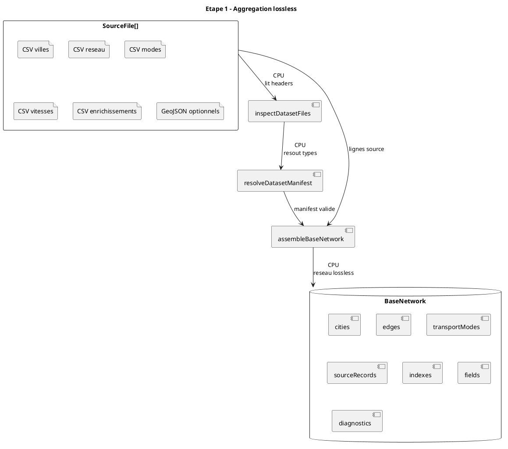
```plantuml
@startuml
title Etape 1 - Aggregation lossless

rectangle "SourceFile[]" as source {
  file "CSV villes"
  file "CSV reseau"
  file "CSV modes"
  file "CSV vitesses"
  file "CSV enrichissements"
  file "GeoJSON optionnels"
}

component "inspectDatasetFiles" as inspect
component "resolveDatasetManifest" as manifest
component "assembleBaseNetwork" as assembly

database "BaseNetwork" as base {
  [cities]
  [edges]
  [transportModes]
  [sourceRecords]
  [indexes]
  [fields]
  [diagnostics]
}

source --> inspect : CPU\nlit headers
inspect --> manifest : CPU\nresout types
manifest --> assembly : manifest valide
source --> assembly : lignes source
assembly --> base : CPU\nreseau lossless
@enduml
```

Points importants:

- cette etape ne calcule pas encore les cones;
- elle ne produit pas de buffers GPU;
- elle ne suppose aucun nom de colonne libre comme `population`;
- elle fournit la base queryable pour les requetes utilisateur.

## Etape 2: Preparation Metier Du Dataset

Responsable principal: CPU.

Entree:

- `BaseNetwork`.

Objectif:

Transformer le reseau lossless en donnees metier compactes, sans encore entrer dans les details GPU. C'est l'equivalent cible de la partie propre de `reader.ts` dans `toBabylon`.

Implementation CPU actuelle:

- `prepareDataset(baseNetwork)` preserve l'ordre stable des villes, modes et
  arêtes resolues;
- les longitudes/latitudes source sont converties des degres vers les radians;
- les arêtes non resolues restent dans `BaseNetwork` mais sont exclues des
  buffers de calcul avec diagnostic;
- toutes les arêtes hors mode `Road` alimentent `curveEdgePairs`, car une arête
  terrestre peut participer aux cones tout en restant une relation du reseau
  representable par une courbe;
- les IDs compacts conservent le chemin vers `BaseNetwork` et `SourceRecord`
  pour les requêtes utilisateur;
- les colonnes libres ne sont pas dupliquees dans `PreparedDataset`;
- `toStaticTownInput` partage directement `cityLonLatRadians` et
  `curveEdgePairs` avec le profil statique CPU.

Traitements:

- construire `cityMap`: `cityCode -> cityIndex`;
- nettoyer ou marquer les arcs non connectables;
- rattacher les arcs incidents aux villes;
- identifier le mode `Road`;
- calculer les distances geodesiques utiles;
- calculer le span temporel global;
- construire les listes de transport par type: modes terrestres pour cones, modes non terrestres pour courbes.

Sortie:

- `PreparedDataset`.

```plantuml
@startuml
title Etape 2 - BaseNetwork vers PreparedDataset

class BaseNetwork {
  cities
  edges
  transportModes
  sourceRecords
  indexes
  fields
}

class PreparedDataset {
  cityMap
  cities
  connectedEdges
  transportModes
  roadModeCode
  span
  transportTypes
  diagnostics
}

component "prepareDataset" as prepare

BaseNetwork --> prepare : entree CPU
prepare --> PreparedDataset : sortie CPU

note right of PreparedDataset
  Niveau metier normalise.
  Pas encore de WebGPU.
  Les colonnes libres restent
  referencees par sourceRecordId.
end note
@enduml
```

Ce niveau est necessaire pour ne pas melanger le contrat lossless avec les structures de calcul. `BaseNetwork` reste la verite source. `PreparedDataset` est une projection metier optimisee pour les etapes suivantes.

## Etape 3: Preparation Des Vitesses Et Des Alphas

Responsable principal: CPU.

Le contrat scientifique complet de `alpha`, son interpretation geometrique et
les invariants a verifier lors du rendu final sont documentes dans
[Modele scientifique: angle alpha, cones dynamiques et courbes](scientific-model-alpha-and-dynamic-cones.md).

Schéma synthétique:


Reference historique:

- `toBabylon/src/application/merger/speedHelper.ts`;
- logique equivalente dans `main/src/application/bigBoard/merger.ts`.

Entrees:

- modes de transport;
- vitesses connues par mode et par annee;
- span temporel;
- mode `Road`.

Traitements:

- interpolation des vitesses par mode pour chaque annee du span;
- calcul de `maxSpeedPerYear`;
- calcul de l'angle `alpha` par mode et par annee;
- separation modes terrestres / non terrestres;
- calcul de l'alpha terrestre minimal ou de l'alpha de reference route.

Sorties:

- `speedPerTranspModePerYear`;
- `maxSpeedPerYear`;
- `terrestrialMinAlphaPerYear`;
- `roadAlphaByYear`;
- `transportTypes`.

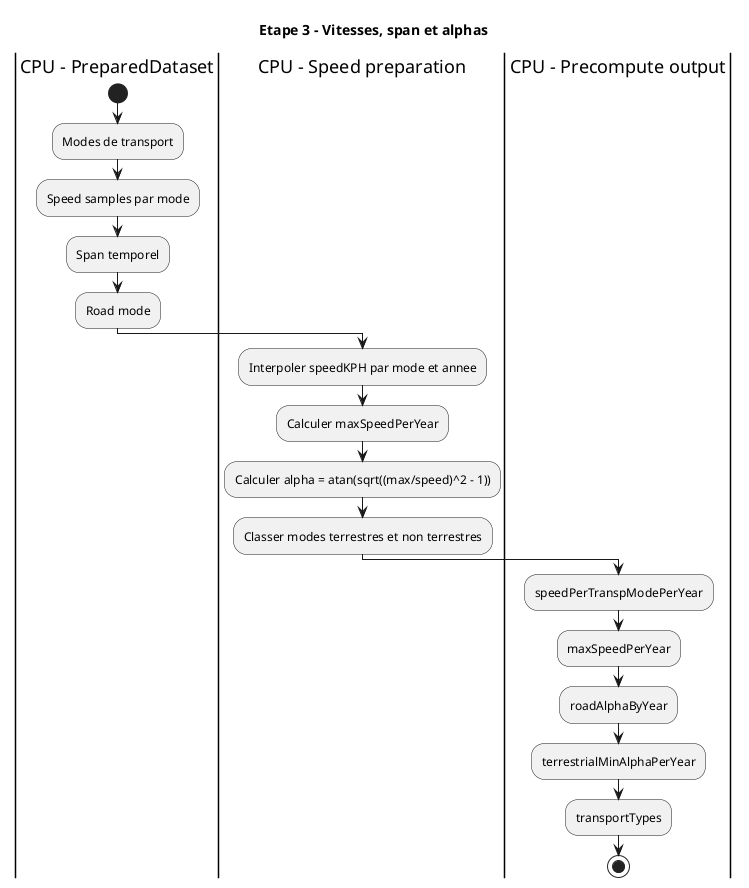
```plantuml
@startuml
title Etape 3 - Vitesses, span et alphas

|CPU - PreparedDataset|
start
:Modes de transport;
:Speed samples par mode;
:Span temporel;
:Road mode;

|CPU - Speed preparation|
:Interpoler speedKPH par mode et annee;
:Calculer maxSpeedPerYear;
:Calculer alpha = atan(sqrt((max/speed)^2 - 1));
:Classer modes terrestres et non terrestres;

|CPU - Precompute output|
:speedPerTranspModePerYear;
:maxSpeedPerYear;
:roadAlphaByYear;
:terrestrialMinAlphaPerYear;
:transportTypes;
stop
@enduml
```

Cette etape est encore CPU car elle depend de peu de donnees et produit des tables temporelles compactes. Elle alimente ensuite les buffers dynamiques par annee.

## Etape 4: Precalcul Statique Des Villes Et Des Paires

Responsables cibles: profils CPU, WebGL2 et WebGPU conformes au meme contrat de
buffers, avec la chaine de repli `WebGPU -> WebGL2 -> CPU`.

Reference historique:

- `toBabylon/src/application/merger/townHelper.ts`;
- shader `toBabylon/src/application/merger/shaders/city.frag`.

Entrees:

- villes preparees;
- longitude, latitude en radians, dans l'ordre stable produit par l'ingestion;
- rayon terrestre;
- nombre de secteurs voisins;
- limite maximale de voisins par ville.

Traitements:

- produire `cityNed2EcefMatrices`, source de verite compacte des positions et
  reperes locaux;
- calculer pour chaque paire de villes:
  - azimut A vers B;
  - azimut B vers A;
  - distance angulaire;
  - index du secteur angulaire;
- construire une selection bornee de voisins par secteurs angulaires;
- calculer les points de controle `[A, P, Q, B]` uniquement pour les arêtes
  connues, et non pour toutes les paires.

Sortie:

- `StaticTownPrecompute`.

```plantuml
@startuml
title Etape 4 - Precalcul statique villes/paires

class PreparedDataset {
  cityMap
  cities
  connectedEdges
}

class StaticTownPrecompute {
  cityNed2EcefMatrices
  cityPairInvariants
  cityPairSectorIndexes
  overlapCandidates
  overlapCandidateCounts
  curveEdgePairs
  curveControlPointsEcef
}

interface StaticTownPrecomputeBackend
component "Profil CPU" as cpu
component "Profil WebGL2" as webgl2
component "Profil GPU WebGPU" as gpu

PreparedDataset --> cpu : villes et arêtes compactes
PreparedDataset --> webgl2 : villes et arêtes compactes
PreparedDataset --> gpu : villes et arêtes compactes
StaticTownPrecomputeBackend <|.. cpu
StaticTownPrecomputeBackend <|.. webgl2
StaticTownPrecomputeBackend <|.. gpu
cpu --> StaticTownPrecompute : buffers de reference
webgl2 --> StaticTownPrecompute : fallback accelere
gpu --> StaticTownPrecompute : buffers de production

note right of StaticTownPrecompute
  Invariant tant que le dataset,
  le modele geodesique ou la strategie
  de voisinage ne changent pas.
end note
@enduml
```

Ce precalcul est un invariant fort. Il ne depend pas de l'annee. Il depend du dataset, du modele de terre et de la strategie de voisinage/intersection.

Dans `toBabylon`, une partie de ce calcul est deja faite via pseudo-compute
WebGL. La migration maintient volontairement trois profils: le CPU sert de
reference fonctionnelle, de dernier fallback et d'oracle de test; WebGL2 est le
fallback accelere; WebGPU execute les calculs intensifs en production. Les
trois profils produisent exactement les memes contrats de buffers.

Le detail des strides, dispatchs, reductions et vues sur buffers est defini
dans [Architecture du precalcul statique des villes](static-town-precompute-architecture.md).

## Etape 5: Precalcul Dynamique Par Annee

Responsable principal: CPU.

Reference historique:

- `toBabylon/src/application/merger/townHelper.ts`, `prepareDynamicTownGeometry`.

Entrees:

- `PreparedDataset`;
- `StaticTownPrecompute`;
- `speedPerTranspModePerYear`;
- `roadAlphaByYear`;
- arcs connectes;
- dates de debut/fin des arcs.

Traitements:

- pour chaque annee du span:
  - initialiser la surface par defaut avec `roadAlpha`;
  - selectionner les arcs actifs;
  - conserver les arcs terrestres pour les cones;
  - emettre explicitement les deux directions de chaque arête bidirectionnelle;
  - convertir chaque destination en index compact;
  - recuperer l'azimut depuis `cityPairInvariants`;
  - recuperer l'alpha du mode;
  - pour une meme destination, conserver le minimum alpha, correspondant au
    mode terrestre actif le plus rapide;
  - borner l'alpha retenu par `roadAlpha`;
  - trier les liens par azimut;
  - produire des tableaux compacts separes;
  - produire un offset et un compte par ville;
  - produire le minimum alpha terrestre connecte par ville;
  - stocker `roadAlpha`.

Sortie:

- `DynamicTownPrecomputeByYear`.

```plantuml
@startuml
title Etape 5 - Precalcul dynamique par annee

class StaticTownPrecompute {
  cityPairInvariants
}

class SpeedPrecompute {
  speedPerTranspModePerYear
  roadAlphaByYear
}

class DynamicTownPrecomputeByYear {
  year
  cityLinkOffsets
  cityLinkCounts
  cityLinkDestinationIndexes
  cityLinkAzimuthRadians
  cityLinkAlphaRadians
  cityFastestTerrestrialAlphaRadians
  roadAlphaRadians
}

component "prepareDynamicTownGeometry" as dynamicPrep

StaticTownPrecompute --> dynamicPrep : azimuts et cityMap
SpeedPrecompute --> dynamicPrep : alphas par mode/annee
dynamicPrep --> DynamicTownPrecomputeByYear : CPU\nun paquet par annee

note right of DynamicTownPrecomputeByYear
  Selectionne quand l'annee change.
  Ne relance pas l'aggregation dataset.
end note
@enduml
```

Le format historique `cityLinks` et `citiesDict` contient une erreur de
convention entre bornes inclusives et exclusives. La migration utilise:

- `cityLinkOffsets`: offset initial par ville;
- `cityLinkCounts`: nombre de liens par ville;
- `cityLinkDestinationIndexes`: destination de chaque lien;
- `cityLinkAzimuthRadians`: azimut de chaque lien;
- `cityLinkAlphaRadians`: minimum alpha retenu pour chaque destination;
- `cityFastestTerrestrialAlphaRadians`: minimum alpha connecte par ville;
- une boucle de lecture `index < offset + count`.

## Etape 6: Upload Vers Les Buffers GPU

Responsable principal: TypeScript orchestration + GPU.

Entrees:

- `StaticTownPrecompute`;
- `DynamicTownPrecomputeByYear[year]`;
- parametres de calcul;
- limites geographiques preparees.

Traitements CPU:

- creer les `GPUBuffer`;
- ecrire les donnees statiques une fois;
- ecrire les donnees dynamiques quand l'annee change;
- creer les bind groups;
- selectionner les pipelines WGSL.

Traitements GPU:

- aucun calcul tant que les passes ne sont pas dispatch;
- les donnees sont seulement disponibles pour les kernels.

Sorties:

- `GpuPreparedResources`;
- bind groups prets pour les passes compute.

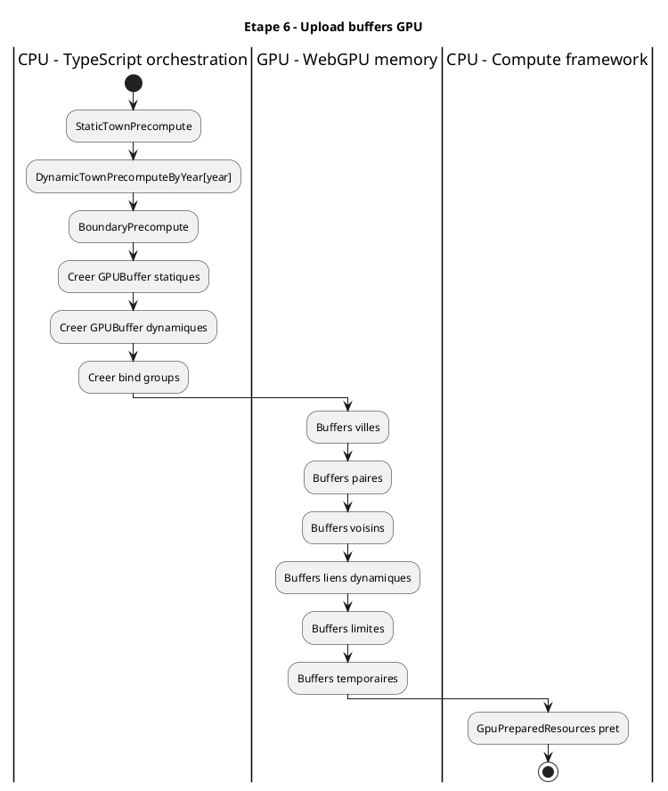
```plantuml
@startuml
title Etape 6 - Upload buffers GPU

|CPU - TypeScript orchestration|
start
:StaticTownPrecompute;
:DynamicTownPrecomputeByYear[year];
:BoundaryPrecompute;
:Creer GPUBuffer statiques;
:Creer GPUBuffer dynamiques;
:Creer bind groups;

|GPU - WebGPU memory|
:Buffers villes;
:Buffers paires;
:Buffers voisins;
:Buffers liens dynamiques;
:Buffers limites;
:Buffers temporaires;

|CPU - Compute framework|
:GpuPreparedResources pret;
stop
@enduml
```

Les buffers statiques ne doivent pas etre recrees a chaque changement d'annee. Les buffers dynamiques peuvent etre remplaces ou mis a jour par `queue.writeBuffer`.

## Etape 7: Generation Des Cones Bruts

Responsable principal: GPU.

Reference historique:

- `toBabylon/src/application/cone/shaders/rawCones.frag`.

Entrees GPU:

- sommets ECEF des villes;
- matrices NED/ECEF;
- `cityLinkOffsets`;
- `cityLinkCounts`;
- `cityLinkAzimuthRadians`;
- `cityLinkAlphaRadians`;
- `roadAlphaRadians`;
- longueur maximale des cones;
- attenuation angulaire.

Traitement:

- pour chaque ville et chaque azimut echantillonne:
  - trouver les alphas voisins de cet azimut;
  - interpoler ou lisser vers `roadAlpha`;
  - calculer la direction locale;
  - convertir en position ECEF;
  - produire un vertex de cone brut.

Sortie:

- `RawConeBuffer`.

Reference CPU implementee:

```ts
interface RawConePrecompute {
  cityCount: number;
  azimuthSampleCount: number;
  shape: 'road' | 'fastest-terrestrial' | 'complex';
  coneLengthMeters: number;
  coneAlphaRadians: Float32Array;
  rawConeRimEcef: Float32Array;
}
```

- `coneAlphaRadians` est dense par `[ville, azimut]`;
- `rawConeRimEcef` utilise un `vec4<f32>` par echantillon, en metres;
- le sommet n'est pas duplique: il reste dans `cityNed2EcefMatrices`;
- le profil CPU constitue la reference de conformite des futurs kernels;
- l'attenuation complexe reproduit les deux voisins circulaires, le retour a
  Road et l'interpolation `smoothstep` du shader historique;
- les bornes angulaires utilisent une tolerance compatible Float32.

```plantuml
@startuml
title Etape 7 - RawConePass

class GpuStaticBuffers {
  summitECEF
  ned2ECEF
}

class GpuDynamicBuffers {
  cityLinkOffsets
  cityLinkCounts
  cityLinkAzimuthRadians
  cityLinkAlphaRadians
  roadAlphaRadians
}

class RawConeBuffer {
  positionECEF[city, azimuth]
}

component "RawConePass WGSL" as raw

GpuStaticBuffers --> raw
GpuDynamicBuffers --> raw
raw --> RawConeBuffer : GPU\nparallel city x azimuth
@enduml
```

Cette passe remplace le role de `rawCones.frag`. Elle est massivement parallele car chaque couple `(ville, azimut)` peut etre calcule independamment.

## Etape 8: Intersections Cone / Cone

Responsable principal: GPU.

Reference historique:

- `toBabylon/src/application/cone/shaders/ciseledCones.frag`.

Entrees GPU:

- `RawConeBuffer`;
- `overlapCandidates`;
- `overlapCandidateCounts`;
- longueurs maximales des cones par ville;
- hierarchie circulaire de blocs de faces;
- invariants de paires pour `gammaAB` et `gammaBA`.

Traitement:

- pour chaque rayon brut d'un cone A:
  - prendre la demi-droite sommet A -> vertex;
  - parcourir uniquement les villes de `overlapCandidates`;
  - calculer le rayon symetrique `phiB0` sur chaque voisin B;
  - prioriser le parcours de `phiB0` vers le plan A-B-centre Terre;
  - parcourir une BVH circulaire de faces;
  - rejeter un bloc lorsque sa borne `blockEntryT` ne peut ameliorer `bestT`;
  - tester les faces retenues avec Moller-Trumbore double face;
  - conserver le minimum `t`;
  - sinon conserver le vertex brut.

Sortie:

- `CiseledConeBuffer`.

```plantuml
@startuml
title Etape 8 - ConeConeIntersectionPass

class RawConeBuffer {
  raw vertices
}

class TownNeighborIndex {
  overlapCandidates
  overlapCandidateCounts
}

class CircularFaceBvh {
  blockBounds
  childIndexes
  faceRanges
}

class CiseledConeBuffer {
  intersected vertices
}

component "ConeConeIntersectionPass WGSL" as intersect

RawConeBuffer --> intersect
TownNeighborIndex --> intersect
CircularFaceBvh --> intersect
intersect --> CiseledConeBuffer : GPU\nray/triangle tests

note right of intersect
  Le voisinage borne evite
  un cout O(n^2 * azimuths)
  non controle.
end note
@enduml
```

C'est la passe centrale a ameliorer. Le detail de la decision est documente
dans `docs/cone-intersection-architecture.md`.

Le voisinage statique est maintenu comme perimetre metier. Le rayon symetrique
et le parcours vers le plan A-B-centre Terre definissent l'ordre probable le
plus efficace. Une augmentation locale de distance ne constitue toutefois pas
un critere d'arret fiable pour un cone deforme. La BVH circulaire fournit un
arret garanti lorsque `blockEntryT >= bestT`.

L'intervalle d'azimuts possible reste une strategie candidate a benchmarker
contre l'oracle exhaustif limite aux voisins statiques.

## Etape 9: Clipping Par Limites Geographiques

Responsable principal: GPU, avec preparation CPU des limites.

Reference historique:

- `toBabylon/src/application/cone/shaders/finalCones.frag`;
- logique de limites dans `main/src/application/cone/coneMeshShader.ts`.
- generation de limites par ville dans `toBabylon/src/application/country/geojson2preVertex.ts`;
- shader historique `toBabylon/src/application/country/shaders/boundaryAlgebre.frag`.

Entrees CPU:

- `BoundaryPrecompute`;
- `townBoundaryEcef`;
- association ville -> pays ou continent calculee pendant `prepareBoundaryPrecompute`.
- `azimuthSampleCount`, qui definit explicitement le nombre d'echantillons angulaires par ville.

Entrees GPU:

- `CiseledConeBuffer`;
- `TownBoundaryBuffer`, issu de `ECEFBoundLimits`;
- `AcceptLimitsBuffer`.

Traitement:

- pour chaque vertex de cone:
  - verifier si la ville accepte le clipping;
  - tester l'intersection avec les triangles de limites;
  - remplacer le vertex par l'intersection la plus proche si necessaire.

Sortie:

- `FinalConeBuffer`.

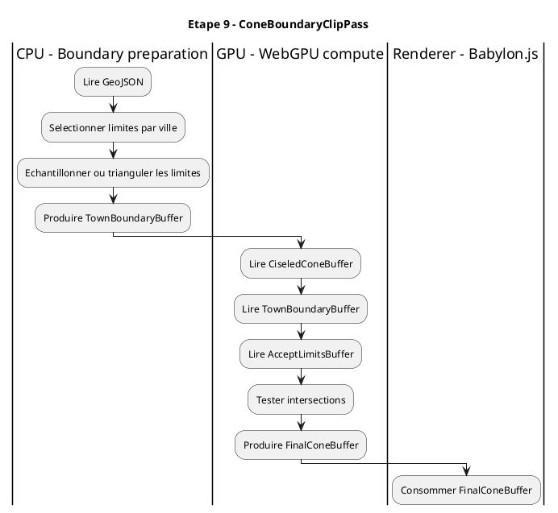
```plantuml
@startuml
title Etape 9 - ConeBoundaryClipPass

|CPU - Boundary preparation|
:Lire GeoJSON;
:Selectionner limites par ville;
:Echantillonner ou trianguler les limites;
:Produire TownBoundaryBuffer;

|GPU - WebGPU compute|
:Lire CiseledConeBuffer;
:Lire TownBoundaryBuffer;
:Lire AcceptLimitsBuffer;
:Tester intersections;
:Produire FinalConeBuffer;

|Renderer - Babylon.js|
:Consommer FinalConeBuffer;
@enduml
```

Les limites geographiques restent un probleme conceptuellement distinct et une
fonction separee dans la reference CPU. Le profil WebGPU peut cependant
fusionner les deux reductions dans la meme invocation:

```text
coneIntersectionT = min(rawT, intersections cones)
finalT = min(coneIntersectionT, countryBoundaryT)
```

Le shader peut ecrire simultanement `ciseledConeRimEcef` pour les tests et
diagnostics, puis `finalConeRimEcef` pour le rendu.

## Etape 10: Generation Des Courbes

Responsables principaux: profil CPU ou GPU pour les invariants, GPU pour les
vertices de rendu.

Reference historique:

- `main/src/application/cone/curveMeshShader.ts`;
- donnees de courbes produites dans `networkFromCities`;
- esquisse `toBabylon` avec `pointPPointQ` et vitesses par mode/annee,
  remplacee dans la cible par `curveControlPointsEcef`.

Entrees CPU invariantes:

- `curveEdgePairs`, limite aux arêtes connues;
- `curveControlPointsEcef`, qui regroupe `[A, P, Q, B]` en ECEF metres;
- theta;
- mode de transport;
- vitesses ou vitesses modelisees par annee;
- `maxSpeedPerYear`.

Entrees dynamiques:

- annee;
- position de courbe;
- nombre de points par courbe;
- projection.

Traitements:

- profil CPU ou GPU:
  - preparer les points de controle uniquement pour les arêtes connues;
  - preparer les tables temporelles;
  - calculer ou selectionner la hauteur de courbe par annee;
- GPU:
  - echantillonner `t`;
  - appliquer Bezier cubique;
  - appliquer hauteur;
  - produire les positions.

Sortie:

- `CurveVertexBuffer`.

```plantuml
@startuml
title Etape 10 - Courbes

class CurvePrecompute {
  curveEdgePairs stride 2
  curveControlPointsEcef stride 16
  theta
  speedByModeByYear
  maxSpeedPerYear
}

class CurveDynamicInput {
  year
  pointsPerCurve
  curvePosition
}

class CurveVertexBuffer {
  positions
}

component "CurveGeometryPass WGSL" as curves

CurvePrecompute --> curves : buffers statiques
CurveDynamicInput --> curves : uniforms ou buffers dynamiques
curves --> CurveVertexBuffer : GPU\nparallel curve x sample
@enduml
```

Les courbes peuvent suivre une migration progressive. Le calcul de leurs
controles est limite aux arêtes connues, ce qui ramene ce travail de `O(N²)` a
`O(E)`. Une premiere implementation peut conserver plusieurs controles
identiques lorsque plusieurs modes partagent la meme origine et destination;
la deduplication pourra etre ajoutee sans changer le contrat public.

La reference CPU est implementee dans
`src/lib/domain/precompute/curve-cpu.ts`. Elle reproduit les points historiques
`P` et `Q` par midpoints normalises successifs et produit directement
`[A, P, Q, B]` en ECEF metres. Les profils WebGL2 et WebGPU ne sont pas encore
implementes.

## Etape 11: Affichage Babylon.js

Responsable principal: renderer.

Entrees:

- `FinalConeBuffer`;
- `CurveVertexBuffer`;
- index buffers;
- donnees de picking;
- metadata ville/source si necessaire.

Traitements:

- creer ou mettre a jour les vertex buffers Babylon;
- affecter les materiaux;
- gerer visibilite, selection, highlighting;
- synchroniser l'UI avec l'etat de calcul.

Sorties:

- meshes visibles;
- interactions utilisateur.

```plantuml
@startuml
title Etape 11 - Affichage

class FinalConeBuffer {
  positions
  uv
  cityId
}

class CurveVertexBuffer {
  positions
  curveId
}

component "Babylon ConeLayer" as cones
component "Babylon CurveLayer" as curves
component "Interaction Layer" as interaction

FinalConeBuffer --> cones : GPUBuffer ou TypedArray
CurveVertexBuffer --> curves : GPUBuffer ou TypedArray
cones --> interaction : picking cityId
curves --> interaction : picking curveId
@enduml
```

Babylon ne doit pas recalculer les intersections. Son role est de representer les donnees finales et d'exposer les interactions.

## Sequence Complete De Changement D'Annee

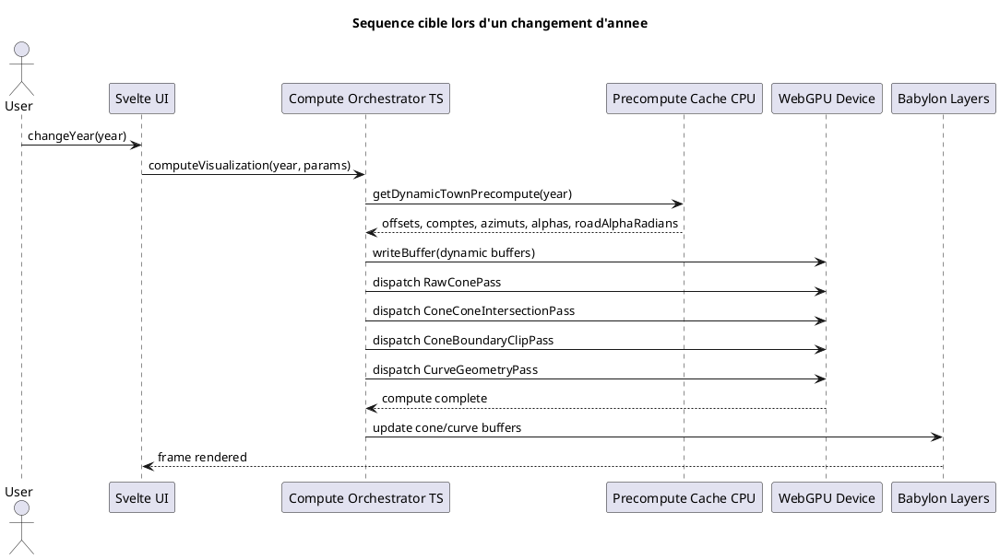
```plantuml
@startuml
title Sequence cible lors d'un changement d'annee

actor User
participant "Svelte UI" as UI
participant "Compute Orchestrator TS" as TS
participant "Precompute Cache CPU" as Cache
participant "WebGPU Device" as GPU
participant "Babylon Layers" as Babylon

User -> UI : changeYear(year)
UI -> TS : computeVisualization(year, params)
TS -> Cache : getDynamicTownPrecompute(year)
Cache --> TS : offsets, comptes, azimuts, alphas, roadAlphaRadians
TS -> GPU : writeBuffer(dynamic buffers)
TS -> GPU : dispatch RawConePass
TS -> GPU : dispatch ConeConeIntersectionPass
TS -> GPU : dispatch ConeBoundaryClipPass
TS -> GPU : dispatch CurveGeometryPass
GPU --> TS : compute complete
TS -> Babylon : update cone/curve buffers
Babylon --> UI : frame rendered
@enduml
```

Le point important: `BaseNetwork`, `PreparedDataset` et `StaticTownPrecompute` ne changent pas pendant cette sequence.

## Sequence Complete De Changement De Dataset

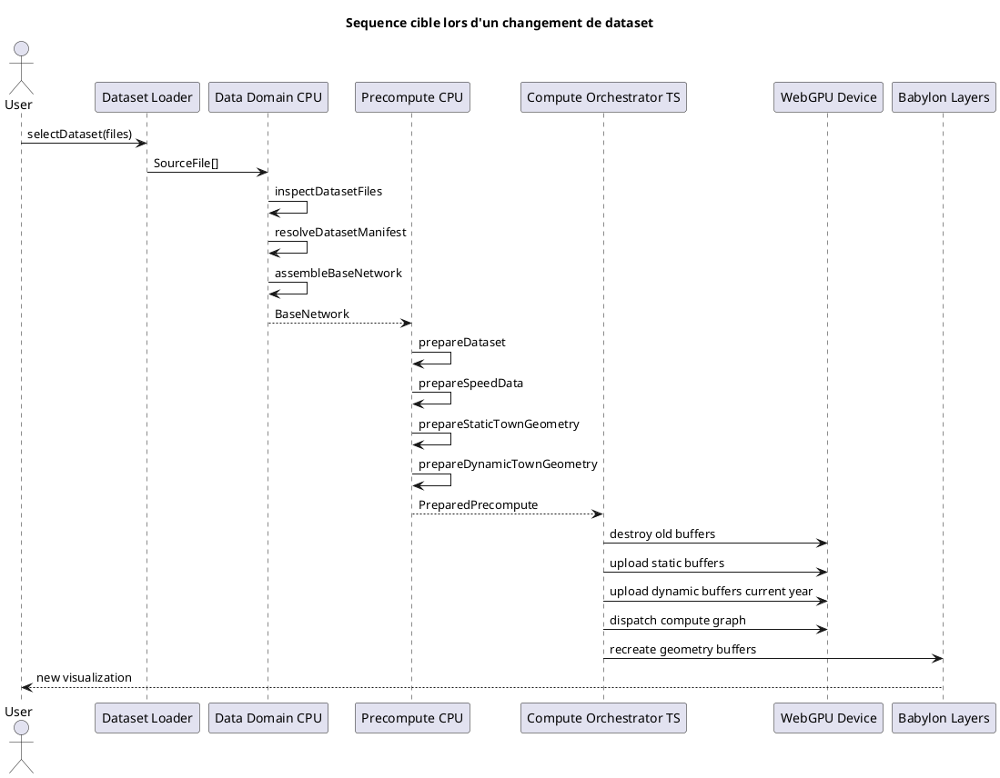
```plantuml
@startuml
title Sequence cible lors d'un changement de dataset

actor User
participant "Dataset Loader" as Loader
participant "Data Domain CPU" as Data
participant "Precompute CPU" as Precompute
participant "Compute Orchestrator TS" as TS
participant "WebGPU Device" as GPU
participant "Babylon Layers" as Babylon

User -> Loader : selectDataset(files)
Loader -> Data : SourceFile[]
Data -> Data : inspectDatasetFiles
Data -> Data : resolveDatasetManifest
Data -> Data : assembleBaseNetwork
Data --> Precompute : BaseNetwork
Precompute -> Precompute : prepareDataset
Precompute -> Precompute : prepareSpeedData
Precompute -> Precompute : prepareStaticTownGeometry
Precompute -> Precompute : prepareDynamicTownGeometry
Precompute --> TS : PreparedPrecompute
TS -> GPU : destroy old buffers
TS -> GPU : upload static buffers
TS -> GPU : upload dynamic buffers current year
TS -> GPU : dispatch compute graph
TS -> Babylon : recreate geometry buffers
Babylon --> User : new visualization
@enduml
```

Ici, tout est reconstruit car les invariants dependent du dataset.

## Matrice Des Responsabilites

| Etape | Acteur principal | Entree | Sortie | Relancee quand |
| --- | --- | --- | --- | --- |
| Inspection dataset | CPU | `SourceFile[]` | `DatasetManifest` | dataset change |
| Assemblage lossless | CPU | fichiers + manifest | `BaseNetwork` | dataset change |
| Preparation metier | CPU | `BaseNetwork` | `PreparedDataset` | dataset change |
| Preparation vitesses | CPU | modes + vitesses | speed/alpha tables | dataset change ou modele vitesse change |
| Precalcul statique villes | backend CPU ou GPU conforme | villes + arêtes | `StaticTownPrecompute` | dataset, modele geodesique ou strategie de voisinage change |
| Precalcul dynamique annuel | CPU | arcs + alphas + statique | `DynamicTownPrecomputeByYear` | dataset, span, mode vitesse ou strategie cone change |
| Upload buffers statiques | CPU/TS + GPU memory | statique | buffers GPU | dataset/precalcul statique change |
| Upload buffers dynamiques | CPU/TS + GPU memory | annee | buffers GPU dynamiques | annee ou parametre dynamique change |
| Raw cones | GPU | statique + dynamique | `RawConeBuffer` | annee, cone shape, longueur, attenuation |
| Intersections cone/cone | GPU | raw cones + voisins | `CiseledConeBuffer` | raw cones ou strategie intersection change |
| Clipping limites | GPU | ciseled + limites | `FinalConeBuffer` | limites, acceptation limites, ciseled |
| Courbes | GPU avec invariants CPU | controles + annee | `CurveVertexBuffer` | annee, position courbe, resolution |
| Affichage | Babylon.js | buffers finaux | meshes visibles | resultats compute ou style change |

## Synthese

La chaine mature a conserver est:

```text
BaseNetwork
  -> PreparedDataset
  -> SpeedPrecompute
  -> StaticTownPrecompute
  -> DynamicTownPrecomputeByYear
  -> GpuPreparedResources
  -> RawConeBuffer
  -> CiseledConeBuffer
  -> FinalConeBuffer
  -> Babylon meshes
```

Le framework WebGPU ne doit pas remplacer le precalcul metier. Il doit l'executer a partir de structures compactes, stables et documentees.

La prochaine etape de migration doit donc etre la formalisation TypeScript de `PreparedDataset`, `StaticTownPrecompute` et `DynamicTownPrecomputeByYear`, en reprenant la logique mature de `toBabylon` avant de porter les passes en WGSL.
