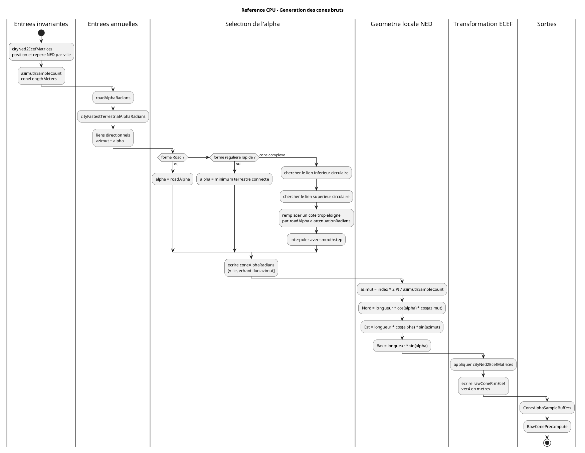

# Modele Scientifique: Angle Alpha, Cones Dynamiques Et Courbes

## Statut

Ce document definit le contrat scientifique retenu pour l'angle `alpha`, le
precalcul dynamique annuel des cones et les courbes reliant deux villes. Il
constitue la reference a utiliser lors des implementations CPU, WebGL2, WebGPU
et du rendu final.

Sources de verite confrontees:

- `markdown/usrdoc/create_dataset.md`;
- `markdown/usrdoc/model_geometry.md`;
- `markdown/usrdoc/basic_usage_tutorial.md`;
- `markdown/devdoc/README_DEVDOC.md`;
- blog TimeSpace, notamment `https://timespace.hypotheses.org/121`;
- article scientifique cite par le projet:
  *What Is the Shape of Geographical Time-Space? A Three-Dimensional Model
  Made of Curves and Cones*.

Schéma synthétique:


Source PlantUML:
`docs/diagrams/precompute/08-alpha-dynamic-cones-curves.puml`.

## Definition De L'Angle Alpha

`alpha` est l'angle de pente utilise pour construire la surface d'un cone de
temps-espace. Il exprime le rapport entre:

- `maximumSpeed`: vitesse maximale disponible pendant l'annee consideree;
- `ambientSpeed`: vitesse terrestre representee localement par la surface.

Formule:

```text
alpha = atan(sqrt((maximumSpeed / ambientSpeed)^2 - 1))
```

Relations equivalentes utiles pour les tests et le rendu final:

```text
cos(alpha) = ambientSpeed / maximumSpeed
maximumSpeed / ambientSpeed = 1 / cos(alpha)
```

Toutes les vitesses internes sont en metres par seconde et `alpha` est en
radians.

### Interpretation Geometrique

Dans le repere local NED d'une ville, une direction de cone est construite avec:

```text
x = cos(alpha) * cos(azimuth)
y = cos(alpha) * sin(azimuth)
z = sin(alpha)
```

Par consequent:

- `alpha = 0`: surface localement plate et `ambientSpeed = maximumSpeed`;
- `alpha` faible: vitesse terrestre locale elevee et cone plus plat;
- `alpha` eleve: vitesse terrestre locale faible et cone plus pentu.

La monotonie fondamentale est:

```text
speedA > speedB  =>  alphaA < alphaB
```

### MaximumSpeed Et RoadAlpha

`maximumSpeed` est calcule pour chaque annee parmi les modes disponibles. Un
mode non terrestre peut definir cette echelle commune sans definir directement
la pente locale d'un cone.

`Road` definit la vitesse terrestre banale et la surface par defaut:

```text
roadAlpha = alpha(maximumSpeed, roadSpeed)
```

Toute direction sans influence d'une liaison terrestre plus rapide utilise
`roadAlpha`. Une liaison plus lente que Road ne doit pas rendre la surface plus
lente:

```text
selectedAlpha = min(roadAlpha, candidateAlpha)
```

## Alpha A Conserver Entre Plusieurs Modes

Lorsque plusieurs modes terrestres actifs relient une ville a la meme
destination pendant une annee, le modele represente la meilleure vitesse
terrestre disponible.

Puisque la vitesse la plus elevee produit l'alpha le plus faible:

```text
selectedAlpha = minimum(activeTerrestrialAlphas)
```

Le code historique `toBabylon/prepareDynamicTownGeometry` conserve le plus
grand alpha. Ce comportement selectionne le mode le plus lent et contredit les
sources de verite. Il ne doit pas etre reproduit dans la migration.

## Variantes De Cones

### Cone Road

- pente uniforme;
- toutes les directions utilisent `roadAlpha`;
- aucune liaison particuliere n'est necessaire.

### Cone Regulier Selon La Meilleure Connexion Terrestre

- pente uniforme pour une ville et une annee;
- utilise le minimum entre `roadAlpha` et tous les alphas terrestres actifs
  connectes a la ville;
- represente la meilleure accessibilite terrestre de la ville dans toutes les
  directions;
- ignore volontairement l'effet tunnel.

### Cone Complexe

- pente variable selon l'azimut;
- pour chaque destination, conserve le minimum alpha parmi les modes terrestres
  actifs reliant cette destination;
- trie les influences par azimut;
- interpole ou attenue entre ces influences et `roadAlpha`;
- s'aplatit dans les directions des reseaux terrestres rapides.

### Loi Directionnelle Retenue Pour Le Cone Complexe

La reference CPU reprend l'intention du bloc commente de
`toBabylon/src/application/cone/shaders/rawCones.frag`.

Pour chaque couple `(ville, azimut echantillonne)`:

1. trouver circulairement le lien immediatement inferieur;
2. trouver circulairement le lien immediatement superieur;
3. remplacer un cote situe au-dela de `attenuationRadians` par un point
   artificiel portant `roadAlpha`;
4. interpoler les deux alphas avec `smoothstep`.

Si plusieurs destinations partagent le meme azimut dans la tolerance Float32,
la direction retient le minimum alpha, donc la vitesse terrestre la plus
elevee.

Avec un lien unique, chaque cote est traite independamment. L'influence
complete peut donc s'etendre jusqu'a `2 * attenuationRadians` autour du lien,
avec un retour progressif vers Road. Ce comportement historique est maintenant
caracterise par les tests et devra etre reproduit par les profils GPU.

Les comparaisons aux bornes utilisent
`FLOAT32_ANGULAR_EPSILON_RADIANS = 1e-6` afin que la reference CPU reste
compatible avec la precision attendue des shaders Float32, notamment au
passage `0/2 PI`.

### Generation Du Bord Brut

Pour une longueur oblique `coneLengthMeters`, chaque echantillon est construit
dans le repere local NED:

```text
north = coneLengthMeters * cos(alpha) * cos(azimuth)
east  = coneLengthMeters * cos(alpha) * sin(azimuth)
down  = coneLengthMeters * sin(alpha)
```

Le vecteur local est ensuite transforme en ECEF metres par la matrice
`cityNed2EcefMatrices` de la ville. Le buffer `rawConeRimEcef` ne contient que
le bord du cone. Le sommet n'est pas duplique puisqu'il est deja disponible
dans la colonne de translation de la matrice NED vers ECEF.

Schéma:



## Courbes Reliant Deux Villes

Une arête du graphe est distincte de sa representation graphique. Toute arête
connue hors mode `Road` peut etre representee par une courbe.

Les invariants statiques de la courbe sont:

- `A`: ville de depart en ECEF metres;
- `B`: ville d'arrivee en ECEF metres;
- `P`: point au quart du grand cercle;
- `Q`: point aux trois quarts du grand cercle;
- `theta`: distance angulaire entre A et B.

Ils sont regroupes dans `curveControlPointsEcef`:

```text
[A, P, Q, B]
```

La geometrie finale de la courbe depend ensuite:

- de l'annee;
- de la vitesse du mode;
- de `maximumSpeed`;
- du modele eventuel de vitesse des liaisons aeriennes courtes;
- du nombre de points demande;
- de la representation choisie: droite, ligne brisee, geodesique ou Bezier.

Les courbes ne definissent pas directement l'alpha local du cone lorsqu'elles
representent un mode non terrestre.

## Arêtes Et Periodes Actives

Une ligne du fichier reseau decrit un service ou une infrastructure
bidirectionnelle. Le precalcul dynamique traite chaque arête resolue une seule
fois, puis emet:

```text
origin -> destination
destination -> origin
```

Une arête influence une annee uniquement si:

- son mode possede une vitesse et un alpha pour cette annee;
- son mode est terrestre pour les calculs de cone;
- `eYearBegin` est absent ou inferieur ou egal a l'annee;
- `eYearEnd` est absent ou superieur ou egal a l'annee.

## Algorithme Dynamique CPU Valide

Pour chaque annee du span historique:

1. Lire `roadAlpha`.
2. Initialiser l'alpha regulier de chaque ville avec `roadAlpha`.
3. Parcourir chaque arête preparee une seule fois.
4. Ignorer les arêtes inactives pendant l'annee.
5. Ignorer les modes non terrestres pour la deformation des cones.
6. Emettre les deux directions de l'arête.
7. Recuperer l'azimut depuis `cityPairInvariants`.
8. Regrouper les influences par `(originCityIndex, destinationCityIndex)`.
9. Conserver le minimum alpha pour chaque destination.
10. Borner ce minimum par `roadAlpha`.
11. Trier les influences de chaque ville par azimut.
12. Produire les buffers compacts.
13. Conserver pour chaque ville le minimum alpha terrestre connecte.

## Contrat De Buffers Cible

Le format historique `cityLinks` / `citiesDict` avec bornes inclusives est
abandonne:

```ts
interface DynamicTownPrecompute {
  year: number;
  roadAlphaRadians: number;

  cityLinkOffsets: Uint32Array;
  cityLinkCounts: Uint32Array;
  cityLinkDestinationIndexes: Uint32Array;
  cityLinkAzimuthRadians: Float32Array;
  cityLinkAlphaRadians: Float32Array;

  cityFastestTerrestrialAlphaRadians: Float32Array;
}
```

Lecture d'une liste:

```ts
const offset = cityLinkOffsets[cityIndex];
const count = cityLinkCounts[cityIndex];

for (let index = offset; index < offset + count; index += 1) {
  // influence valide
}
```

Les destinations sont conservees explicitement pour les tests, diagnostics,
requêtes, interactions et futures evolutions algorithmiques.

## Etat De L'Implementation CPU

Le profil CPU de reference est implemente dans
`src/lib/domain/precompute/cpu/dynamic-town-cpu.ts`.

- `PreparedDataset.edgeYearBegins` et `edgeYearEnds` compactent les periodes
  inclusives des arêtes sans relire le reseau lossless;
- `computeDynamicTownPrecomputeForYearCpu` produit un paquet annuel;
- `computeDynamicTownPrecomputeByYearCpu` produit tout le span historique;
- les arêtes sont parcourues une seule fois par annee et emettent les deux sens;
- `Road` et les modes non terrestres sont exclus des liens de cone;
- un lien plus lent que Road est borne a `roadAlpha`;
- les doublons de destination retiennent le minimum alpha;
- les listes sont triees par azimut puis compactees sans trou;
- `DynamicCityLinksView` expose les buffers sans dupliquer les donnees;
- `benchmarkDynamicTownPrecomputeCpu` mesure une annee et le span complet.

Ces sorties constituent la reference attendue pour les futurs profils WebGL2
et WebGPU.

La passe suivante est implementee dans
`src/lib/domain/precompute/cpu/raw-cone-cpu.ts`:

- `computeConeAlphaSamplesCpu` selectionne les alphas directionnels;
- `computeRawConePrecomputeCpu` produit le bord ECEF brut;
- les formes `road`, `fastest-terrestrial` et `complex` partagent le meme
  contrat;
- `RawConeRimView` expose un echantillon sans recopier les buffers;
- `benchmarkRawConePrecomputeCpu` mesure separement les alphas et la geometrie
  complete.

## Erreur D'Offsets Historique

`toBabylon/prepareDynamicTownGeometry` produit une borne de fin ressemblant a
une borne exclusive, mais le shader historique la parcourt comme une borne
inclusive. Il avance ensuite avec `oldPos = newPos + 1` sans inserer de valeur
dans `cityLinks`.

Cela cree des lectures hors plage logique et des trous entre villes. Le bug est
masque dans `toBabylon` car le bloc consommant les liens est commente dans
`rawCones.frag`.

La migration utilise exclusivement `offset + count` avec une borne superieure
exclusive.

## Verifications Necessaires Lors Du Rendu Final

Le renderer ne calcule pas alpha, mais le resultat visuel doit respecter:

- une vitesse terrestre plus rapide produit un cone plus plat;
- `maximumSpeed == ambientSpeed` produit `alpha == 0`;
- une ville sans liaison terrestre rapide utilise `roadAlpha`;
- le cone regulier rapide utilise le minimum alpha connecte;
- le cone complexe s'aplatit dans les directions des liaisons rapides;
- une liaison plus lente que Road ne rend jamais la surface plus pentue que
  `roadAlpha`;
- une legende respecte
  `maximumSpeed / ambientSpeed = 1 / cos(alpha)`;
- les courbes relient les controles `[A, P, Q, B]` et leur longueur visuelle
  reste coherente avec le rapport de vitesses du modele.

Ces invariants doivent etre testes numeriquement avant les tests visuels.
